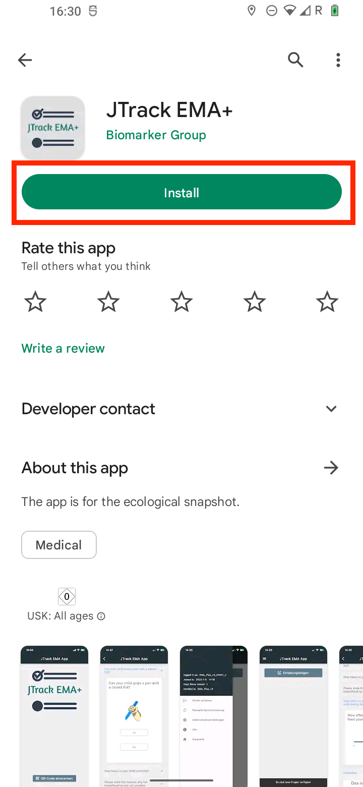
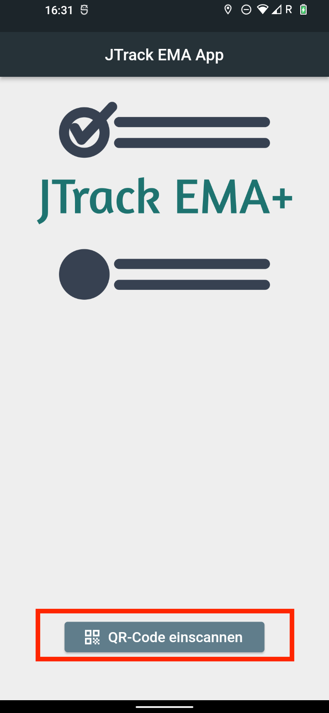
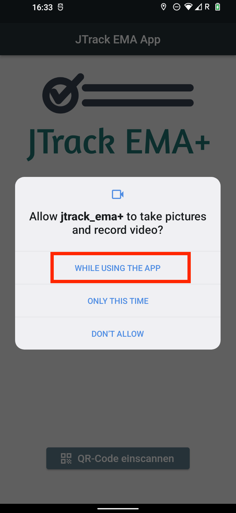
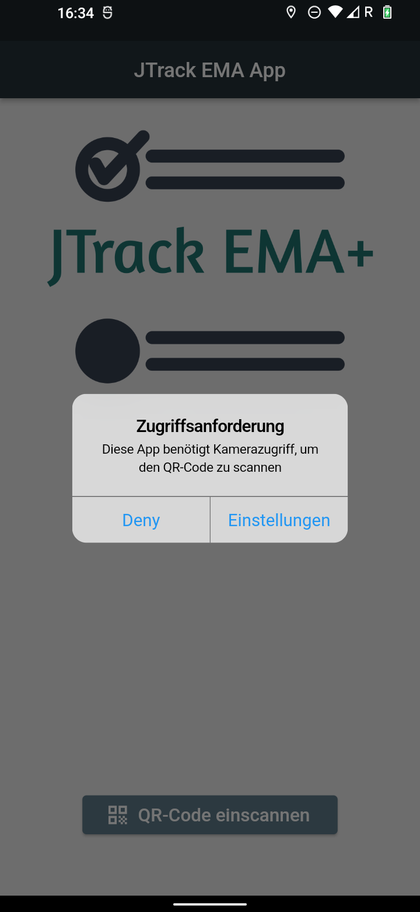
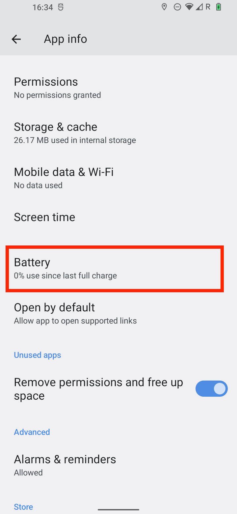
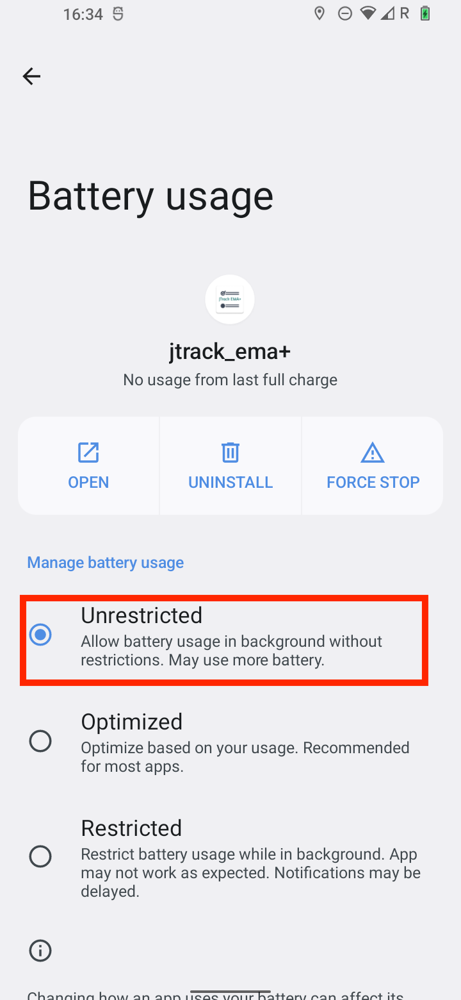

=====================
JTrack EMA
=====================

JTrack EMA is available for **Android** and **iOS**:

- In the `Google Play Store <https://play.google.com/store/apps/details?id=inm7.JTrack.JTrack_EMA_Plus>`__
- In `Apple's App Store <https://apps.apple.com/de/app/jtrack-ema/id1605100657>`__

General Settings
^^^^^^^^^^^^^^^^

To install this app, first go to the Google Play Store on your Android phone.

|

|

Once the app is installed, open the **JTrack EMA+** app and click on the **Join Study** button.

|

|

This app needs to access the camera to scan a QR code. Therefore, accept the permission prompt as shown below.

|

|

Now you can scan the provided QR code using your device’s camera.

.. important::
   For more information about QR codes and how to generate them, please see the relevant section of this documentation.

Once login is successful, you will see the following screen. It asks you to go to the app settings page and change the settings according to the following steps:

|

|

Next, look for **Battery Optimization** and select it.

|

|

Then select the **Unrestricted** option as shown below. This step ensures that the JTrack EMA app will not be restricted by the Android system.

|

|

Now go back to the **App Info** page and scroll to find **Remove permissions and free up space**, and make sure that it is disabled.

|

.. image:: image/EMA/EMA_7.png
   :scale: 40 %
   :align: center

|

Now the main setup of the JTrack EMA+ application is complete. You can proceed to use the app as intended.