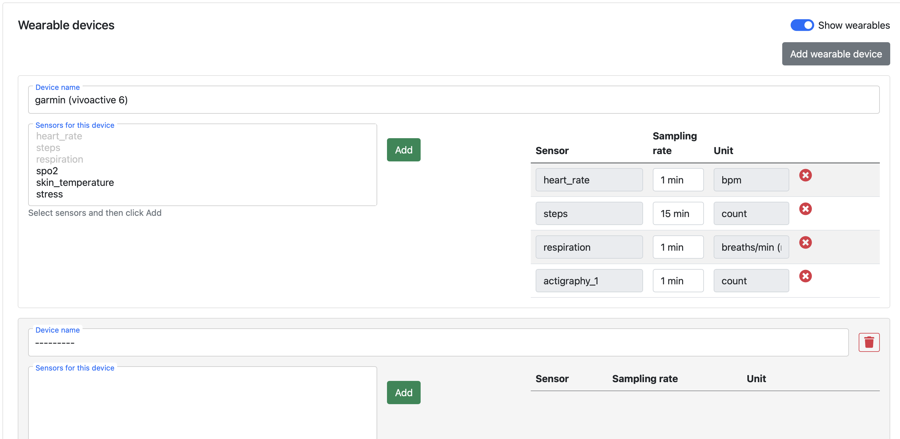
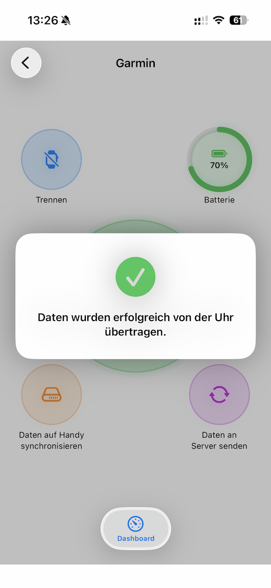
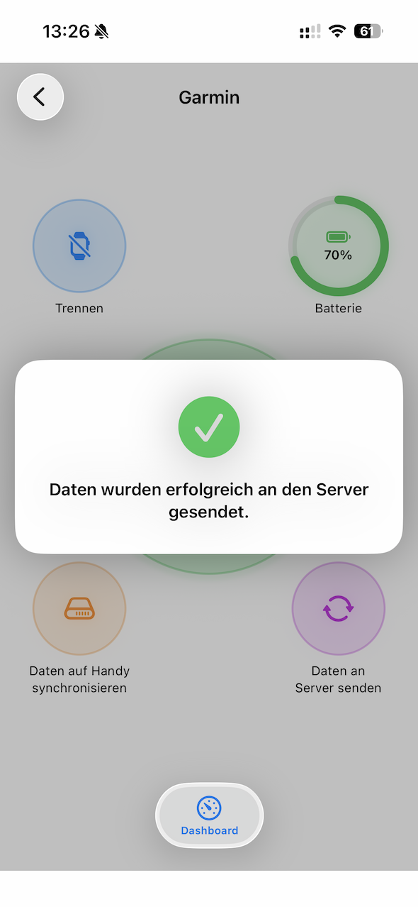
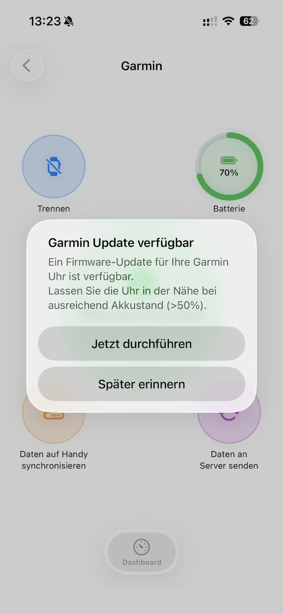

=========================================================================================================
Garmin Integration
=========================================================================================================

JTrack Social supports Garmin wearable integration using the Garmin Health Standard SDK.
The integration enables collection of physiological and behavioral sensor data directly from supported
Garmin smartwatches while maintaining GDPR-compliant study workflows.
We use a direct Bluetooth connection that does not require the Garmin Connect app.

The Garmin integration currently supports:

- Background synchronization
- Local device-to-phone synchronization
- Secure upload to the study server
- Firmware updates of connected watches
- Configuration of connected watches

Wearable Sensors include:

- Actigraphy
- BBI
- Calories
- enhancedBBI
- Heart Rate
- Respiration
- Skin Temperature
- SpO2
- Steps
- Stress
- Wrist Status
- Zero Crossing

.. note::

   Garmin wearable functionality is only available in studies where Garmin support has been enabled by the study administrator.

|

Getting Started (JDash Study Setup)
=========================================================================================================

To enable Garmin support in a study, Garmin wearable sensors must first be configured in the JDash study editor.

Example configuration:

The wearable configuration is automatically downloaded to the participant device after enrollment.

|

Configure on the Phone (JTrack Social)
=========================================================================================================

.. _garmin-pair:

Pairing after Enrollment
-------------------------------------------

After successful enrollment into a Garmin-enabled study, participants can pair their Garmin smartwatch directly inside the JTrack Social app by either responding to the popup or going to the Garmin Dashboard and clicking ``Pair``.
The popup will guide the user through the process.

.. raw:: html

   

      

         
         
<strong>Step 1</strong>

      

      

         
         
<strong>Step 2</strong>

      

    

.. raw:: html

   

      <!-- Step 3 main image -->
      

         
         

            <strong>Step 3</strong>
         

      

      <!-- Slider sequence -->
      

         
         
         
      

   

.. raw:: html

   

      

         
         
<strong>Step 4</strong>

      

      

         
         
<strong>Pairing process</strong>

      

    

After pairing, JTrack Social automatically configures the Garmin device according to the study settings defined in JDash.

This includes:

- Enabled sensors
- Sampling intervals
- Background synchronization settings

The configuration process may take several seconds.

|

Configure the Watch
-------------------------------------------

When starting a Garmin watch for the first time information about the user is being asked by the watch (age, gender, weight, height, etc.).
This is required by Garmin for internal Watch algorithms to function properly.
Occasionally, e.g. if a watch has not been set-up by a participant, an additional configuration of user settings on the watch is needed.
Therefore a configuration dialogue appears that asks for relevant information after a successful pairing. These get passed straight to the watch.

.. raw:: html

   

      

         
         
<strong>iOS</strong>

      

      

         
         
<strong>Android</strong>

      

   

.. note::

   This data is handled with great care and not being stored or examined by JTrack in any way. It solely serves the purpose to improve the accuracy of the data collected by the Garmin watch.

|

Garmin Dashboard
-------------------------------------------

The Garmin Dashboard is accessible from the main menu:

.. raw:: html

   

      

         
         
<strong>iOS</strong>

      

      

         
         
<strong>Android</strong>

      

   

It provides an overview of:

- Paired devices
- Battery level
- Connection state
- Last synchronization
- Local wearable data status

The dashboard also provides manual synchronization and device management functionality.

.. raw:: html

   

      

         
         
<strong>iOS</strong>

      

      

         
         
<strong>Android</strong>

      

   

|

Pair / Unpair Devices
-------------------------------------------

Participants can pair or unpair Garmin devices directly inside the Garmin Dashboard.
Pairing works in the same way as explained in :ref:`garmin-pair`.

Unpairing removes:

- Device association
- Active synchronization
- Watch-side study configuration

.. warning::

   Unpairing a device stops future wearable data collection for the study.

.. raw:: html

   

      

         
         
<strong>Unpair</strong>

      

      

         
         
<strong>Status after unpair</strong>

      

   

|

Sync to Phone
-------------------------------------------

Wearable data is first synchronized locally from the Garmin watch to the participant phone.

Synchronization can occur:

- Automatically in the background
- When the app becomes active
- Manually using ``Sync to Phone``

The synchronization process downloads new wearable sensor recordings from the watch.

|

Send to Server
-------------------------------------------

After synchronization to the phone, wearable data can be uploaded securely to the study server.

Uploads occur automatically when all of these conditions are met:

- Internet access is available
- Wi-Fi restrictions allow uploads
- The server is reachable
- Background processing is permitted

Participants may also trigger uploads manually.

|

Firmware Update
-------------------------------------------

JTrack Social can detect and perform available Garmin firmware updates through the Bluetooth connection.

Participants may be prompted to update the watch firmware. However, updates are not required but might be useful for extended study periods.

.. note::

   Firmware updates are handled through Garmin device services and may require several minutes.

|

Features for Study Administrators
=========================================================================================================

Overwrite Watch Configuration
-------------------------------------------

Administrators can overwrite the active Garmin watch configuration directly from the app via ``Settings -> Garmin Dashboard -> Config``.

This allows updated user settings (age, gender, weight, height, etc.) for improved accuracy of Garmin measurements.

.. raw:: html

   

      

         
         
<strong>iOS</strong>

      

      

         
         
<strong>Android</strong>

      

   

|

Advanced SDK Status
-------------------------------------------

The Garmin Dashboard includes advanced SDK status information for debugging and monitoring via the ``Advanced`` tab.

Available information includes:

- SDK initialization state
- Bluetooth connection state
- Device readiness

.. raw:: html

   

      

         
         
<strong>iOS</strong>

      

      

         
         
<strong>Android</strong>

      

   

|

Console Logging for Debugging
-------------------------------------------

Verbose Garmin SDK console logging is enabled for debugging purposes and can be accessed via the ``Console`` tab.

Logs may include:

- Pairing events
- Synchronization progress
- Device communication
- Sensor configuration
- Snippets of logged data
- Upload operations

.. warning::

   Beware that the possible actions here are only for debugging purposes and can temporarily interfere with the participant workflow.

.. raw:: html

   

      

         
         
<strong>iOS</strong>

      

      

         
         
<strong>Android</strong>

      

   

