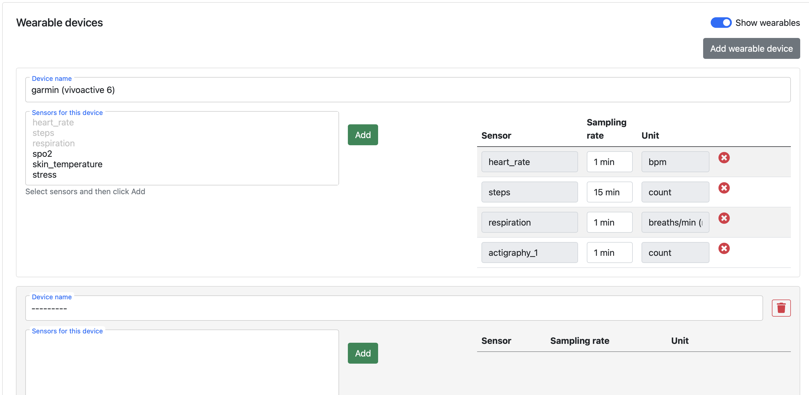
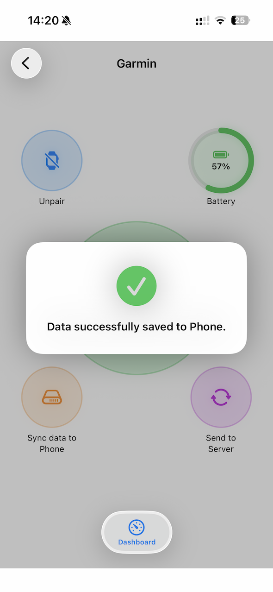
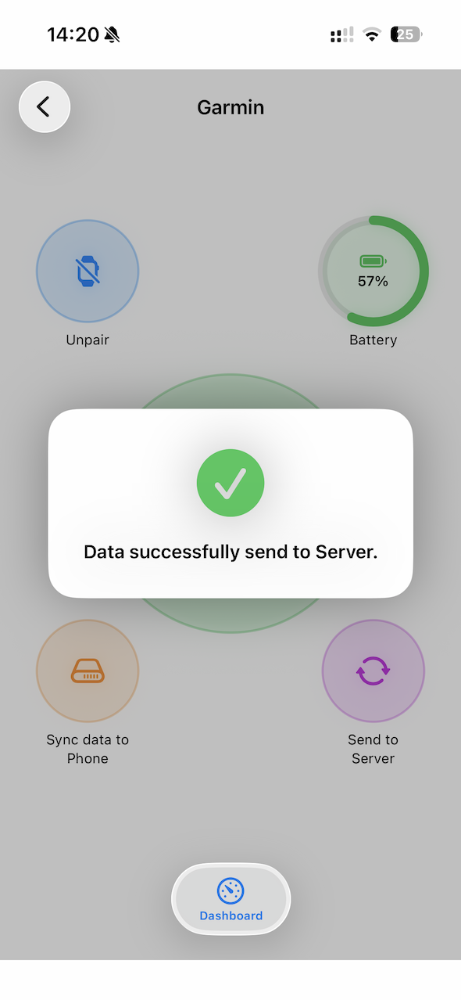
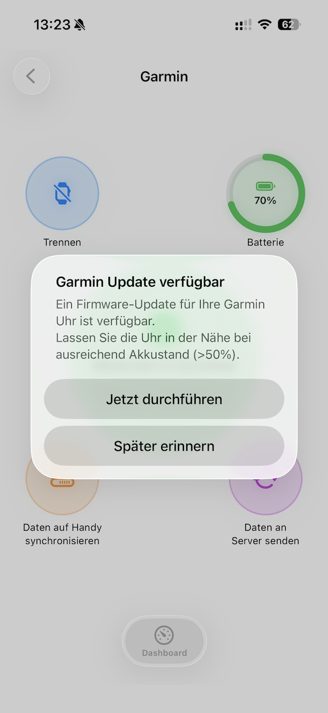

=========================================================================================================
Garmin Integration
=========================================================================================================

JTrack Social supports compatible Garmin wearables through the **Garmin Health Standard SDK** on Android and iOS. The phone communicates directly with the watch over Bluetooth; the Garmin Connect app and a participant-owned Garmin account are not required for the JTrack study workflow.

The study configuration determines which wearable signals are requested and at which supported sampling interval. Availability still depends on the watch model, firmware, SDK support, and the Garmin features licensed for the JTrack deployment.

The Garmin integration currently supports:

- pairing and study-specific watch configuration;
- automatic background synchronization where the operating system permits it;
- foreground synchronization whenever JTrack Social becomes active;
- manual watch-to-phone synchronization and server upload;
- local FIT-file processing and downsampling; and
- device status, firmware, configuration, and diagnostic tools for administrators.

Wearable Sensors include:

- Actigraphy
- BBI
- Calories
- Enhanced BBI
- Heart Rate
- PPG (only on supported and licensed devices)
- Respiration
- Skin Temperature
- SpO2
- Steps
- Stress
- Wrist Status
- Zero Crossing

.. note::

   Garmin wearable functionality is shown only when Garmin sensors are enabled by the study administrator. A signal listed here is not a guarantee that every Garmin model exposes it.

.. _recommended-garmin-devices:

Recommended Garmin Devices
=========================================================================================================

The **vívoactive 6** is the primary JTrack recommendation because it is the model currently used and tested by the project. It provides a useful balance of health signals, battery life, size, availability, and cost.

The table below compares built-in consumer-device capabilities that are relevant when selecting study hardware. ``✓`` means that Garmin documents the feature for the device; ``✗`` means that the device does not provide it. These entries do **not** guarantee that the measurement is exposed by the Garmin Health Standard SDK or by the current JTrack license.

.. list-table:: Garmin devices for study planning
   :header-rows: 1
   :stub-columns: 1
   :widths: 24 15 15 15 15 15

   * - Capability
     - Forerunner 55
     - vívoactive 6
     - Forerunner 570
     - fēnix 8 Pro
     - CIRQA Smart Band
   * - JTrack recommendation
     - Budget candidate
     - **Recommended and tested**
     - Current running watch
     - Flagship / specialist studies
     - Promising; validate first
   * - Approximate market position
     - Entry level; often discounted near €100
     - Mid-range health and fitness
     - Advanced running and triathlon
     - Premium multisport flagship
     - Screenless health band
   * - Wrist heart rate
     - ✓
     - ✓
     - ✓
     - ✓
     - ✓
   * - Pulse Ox / SpO2
     - ✗
     - ✓
     - ✓
     - ✓
     - ✓
   * - Respiration, stress, and steps
     - ✓
     - ✓
     - ✓
     - ✓
     - ✓
   * - Sleep tracking
     - ✓
     - ✓
     - ✓
     - ✓
     - ✓
   * - Skin-temperature feature
     - ✗
     - ✗
     - ✓
     - ✓
     - ✓
   * - Accelerometer
     - ✓
     - ✓
     - ✓
     - ✓
     - ✓
   * - Gyroscope
     - ✗
     - ✓
     - ✓
     - ✓
     - ✗
   * - On-device GPS
     - ✓
     - ✓
     - ✓
     - ✓
     - ✗
   * - Barometric altimeter
     - ✗
     - ✗
     - ✓
     - ✓
     - ✗
   * - Published smartwatch-mode battery life
     - Up to 14 days
     - Up to 11 days
     - Up to 10–11 days, depending on size
     - Up to 27 days for the 51 mm AMOLED model
     - Up to 10 days

Selection Guidance
-------------------------------------------

**For most JTrack studies**
   Use the **vívoactive 6**. It is the project's reference device and has already produced Heart Rate, BBI, Enhanced BBI, respiration, SpO2, stress, steps, actigraphy, and related FIT data in the JTrack workflow.

**For a low-cost pilot**
   The **Forerunner 55** may be available near €100 through discounts or remaining stock, but it lacks Pulse Ox, skin temperature, and a gyroscope. Confirm exact Garmin Health Standard SDK support with Garmin before purchasing a study batch.

**For running-focused studies**
   The **Forerunner 570** adds newer health sensing, skin-temperature features, multi-band positioning, and advanced training functionality. It should still be validated with the study's exact JTrack signal list.

**For outdoor or specialist protocols**
   The **fēnix 8 Pro** offers the broadest hardware set, long battery life, premium positioning, and rugged construction. It is usually unnecessary for standard passive health monitoring and substantially increases device cost.

**For discreet 24/7 wear**
   The new **CIRQA Smart Band** is screenless and provides heart rate, Pulse Ox, respiration, stress, sleep, skin temperature, steps, and up to 10 days of battery life. It relies on connected phone GPS and is not yet a JTrack reference device. Confirm Standard SDK compatibility and complete an end-to-end pilot before choosing it for a study.

.. important::

   Garmin's `Health SDK overview <https://developer.garmin.com/health-sdk/overview/>`_ lists supported device families and signal categories but warns that some individual models may not be supported. Before procurement, ask Garmin Health to confirm the exact model and required Standard SDK features, then test pairing, configuration, FIT transfer, ingestion, and upload in JTrack Social.

Consumer feature references: `Forerunner 55 and vívoactive 6 comparison <https://www.garmin.com/en-US/compare/?compareProduct=1555457&compareProduct=741137>`_, `Forerunner 570 announcement <https://www.garmin.com/en-US/newsroom/press-release/sports-fitness/garmin-unveils-the-forerunner-570-and-forerunner-970-its-newest-gps-running-and-triathlon-smartwatches-for-performance-driven-athletes/>`_, `fēnix 8 Pro comparison <https://www.garmin.com/en-US/compare/?compareProduct=1703902>`_, and `CIRQA product page <https://www.garmin.com/en-US/p/1989182/>`_. Features and prices can change by region, firmware, and date.

.. _garmin-architecture:

Collection and Processing Architecture
=========================================================================================================

Garmin records data on the watch and transfers archived FIT files to JTrack Social. JTrack then processes those files into the common JTrack ``HealthSensor`` format before upload.

On iOS, the Garmin SDK is configured to persist FIT files while JTrack performs the data processing itself. Two input paths are handled:

* **Custom Logging FIT:** high-resolution signals such as heart rate, BBI, Enhanced BBI, respiration, SpO2, stress, steps, actigraphy, wrist status, and other configured custom-logging fields.
* **Wellness FIT:** Garmin wellness records that are mapped through the corresponding Garmin wellness sensor definitions.

Samples are downsampled **before** Core Data objects are created. They are grouped into timestamp buckets and inserted in batches, which avoids creating millions of temporary database objects for high-frequency recordings.

Supported configured intervals currently include ``1 s``, ``10 s``, ``30 s``, ``1 min``, ``5 min``, ``10 min``, and ``15 min``. The chosen interval is applied per configured wearable signal. High-resolution values present in a FIT file, such as BBI or Enhanced BBI, are retained according to their signal-specific processing rather than being interpreted as a continuous 64 Hz waveform.

Passive and Active Measurements
-------------------------------------------

Normal Garmin monitoring uses the signals and intervals configured in JDash. Active Labeling can additionally associate wearable data with a defined task window, but it does not automatically unlock raw signals that the Garmin SDK, watch model, or license does not expose.

Raw PPG and other experimental high-frequency cardio streams are therefore device- and license-dependent. Administrators can use the experimental Garmin diagnostic view to test the maximum available mode, including the explicit case where PPG is not licensed. These tests are diagnostic tools and are not part of the standard passive-monitoring protocol.

|

Getting Started (JDash Study Setup)
=========================================================================================================

To enable Garmin support in a study, Garmin wearable sensors must first be configured in the JDash study editor.

Example configuration:

The wearable configuration is downloaded after enrollment and stored on the phone. Each configured entry can specify the wearable, signal name, sampling rate, and unit. JTrack Social exposes the effective wearable configuration in its information and administration views.

|

Configure on the Phone (JTrack Social)
=========================================================================================================

.. _garmin-pair:

Pairing after Enrollment
-------------------------------------------

After successful enrollment into a Garmin-enabled study, participants can pair their Garmin smartwatch directly inside the JTrack Social app by either responding to the popup or going to the Garmin Dashboard and clicking ``Pair``.
The popup will guide the user through the process.

.. raw:: html

   

      

         
         
<strong>Step 1</strong>

      

      

         
         
<strong>Step 2</strong>

      

    

.. raw:: html

   

      <!-- Step 3 main image -->
      

         
         

            <strong>Step 3</strong>
         

      

      <!-- Slider sequence -->
      

         
         
         
      

   

.. raw:: html

   

      

         
         
<strong>Step 4</strong>

      

      

         
         
<strong>Pairing process</strong>

      

    

After pairing, JTrack Social configures the Garmin device according to the study settings defined in JDash.

This includes:

- Enabled sensors
- Sampling intervals
- Supported collection settings

The configuration process may take several seconds.

|

Configure the Watch
-------------------------------------------

When starting a Garmin watch for the first time information about the user is being asked by the watch (age, gender, weight, height, etc.).
This is required by Garmin for internal Watch algorithms to function properly.
Occasionally, e.g. if a watch has not been set-up by a participant, an additional configuration of user settings on the watch is needed.
Therefore a configuration dialogue appears that asks for relevant information after a successful pairing. These get passed straight to the watch.

.. raw:: html

   

      

         
         
<strong>iOS</strong>

      

      

         
         
<strong>Android</strong>

      

   

.. note::

   These profile values are passed to the watch so Garmin's internal algorithms can operate correctly. JTrack does not use them as research measurements or upload them as participant sensor records.

|

Garmin Dashboard
-------------------------------------------

The Garmin Dashboard is accessible from the main menu:

.. raw:: html

   

      

         
         
<strong>iOS</strong>

      

      

         
         
<strong>Android</strong>

      

   

It provides an overview of:

- Paired devices
- Battery level
- Connection state
- Last synchronization
- Local wearable data status
- Synchronization and upload progress

The dashboard also provides manual synchronization and device management functionality.

.. raw:: html

   

      

         
         
<strong>iOS</strong>

      

      

         
         
<strong>Android</strong>

      

   

|

Pair / Unpair Devices
-------------------------------------------

Participants can pair or unpair Garmin devices directly inside the Garmin Dashboard.
Pairing works in the same way as explained in :ref:`garmin-pair`.

Unpairing disables future JTrack collection from that watch and removes the app-side device association and watch-side study configuration.

Before unpairing, use the available synchronization controls to retrieve and upload pending records. Unpairing removes:

- Device association
- Active synchronization
- Watch-side study configuration

.. warning::

   Unpairing a device stops future wearable data collection for the study.

.. raw:: html

   

      

         
         
<strong>Unpair</strong>

      

      

         
         
<strong>Status after unpair</strong>

      

   

.. note::
   The app cannot override iOS Bluetooth settings. To remove the system-level Bluetooth association, open ``Settings -> Bluetooth`` on the iPhone and remove the Garmin watch manually.

|

Sync to Phone
-------------------------------------------

Wearable data is first synchronized locally from the Garmin watch to the participant phone and then ingested from FIT into Core Data.

Synchronization can occur:

- Automatically in the background
- Whenever the app becomes active
- Manually using ``Sync to Phone``

The synchronization process downloads new recordings, processes both custom-logging and wellness FIT files, downsamples configured signals, and inserts the resulting records in batches. iOS may limit background execution time; JTrack therefore also retries this work in the foreground.

|

Send to Server
-------------------------------------------

After synchronization and local FIT ingestion, Garmin records are sent sequentially by sensor to the study server.

Uploads occur automatically when all of these conditions are met:

- Wi-Fi is connected
- Internet access is available
- The server is reachable
- Background processing is permitted

Wearable transfer is Wi-Fi-only. Participants and administrators may also trigger synchronization and upload from the Garmin Dashboard. General manual phone-data synchronization does not duplicate Garmin transfer because the wearable dashboard owns this workflow.

.. important::

   When the study duration has ended, JTrack stops starting new Garmin collection and does not fetch additional wearable data during the 48-hour final SensorKit waiting period. The final verified study-leave workflow handles data that was already stored locally.

|

Firmware Update
-------------------------------------------

The Garmin Dashboard can detect and perform firmware updates made available through Garmin device services.

Participants may be prompted to update the watch firmware. Study staff should schedule updates so they do not interrupt an active measurement or synchronization.

.. note::

   Firmware updates are handled through Garmin device services and may require several minutes.

|

.. _garmin-admin-tools:

Features for Study Administrators
=========================================================================================================

Overwrite Watch Configuration
-------------------------------------------

Administrators can overwrite the active Garmin watch configuration directly from the app via ``Settings -> Garmin Dashboard -> Config``.

This allows updated user settings (age, gender, weight, height, etc.) for improved accuracy of Garmin measurements.

.. raw:: html

   

      

         
         
<strong>iOS</strong>

      

      

         
         
<strong>Android</strong>

      

   

.. note::

    It may take some time for these changes to be properly applied to the Garmin watch.

|

Advanced SDK Status
-------------------------------------------

The Garmin Dashboard includes advanced SDK status information for debugging and monitoring via the ``Advanced`` tab. These controls are available independently of the normal participant workflow.

Available information includes:

- SDK initialization state
- Bluetooth connection state
- Device readiness
- FIT ingestion and local-data state
- Effective study configuration

.. raw:: html

   

      

         
         
<strong>iOS</strong>

      

      

         
         
<strong>Android</strong>

      

   

|

Console Logging for Debugging
-------------------------------------------

Garmin SDK and JTrack processing messages can be inspected through the ``Console`` tab. Logging covers the watch-to-phone, FIT-processing, and upload stages so administrators can distinguish connection problems from ingestion or server-transfer problems.

Logs may include:

- Pairing events
- Synchronization progress
- Device communication
- Sensor configuration
- Snippets of logged data
- FIT-file processing and downsampling
- Upload operations

.. warning::

   Beware that the possible actions here are only for debugging purposes and can temporarily interfere with the participant workflow.

For phone-sensor debugging and the other protected iOS tools, see :ref:`Administrator Tools <social-admin-tools>`. For general connection and reporting checks, see :doc:`Troubleshooting <Troubleshooting>`.

.. raw:: html

   

      

         
         
<strong>iOS</strong>

      

      

         
         
<strong>Android</strong>

      

   

