=========================================================================================================
JDash – JTrack Dashboard
=========================================================================================================

JDash is a Django-based web platform for managing digital health studies conducted through JTrack mobile applications. This provides a unified interface to design, monitor, and manage behavioral and sensor-based research studies initiated by 
clinical institutions and the `Biomarker Development Group <https://www.fz-juelich.de/inm/inm-7/DE/Forschung/Biomarkerentwicklung/artikel.html?nn=653672>`_.
The system connects mobile app data with researcher-controlled dashboards. The main goal is to simplify the lifecycle of digital studies — from study setup and survey design to subject enrollment, progress monitoring, and data validation.

System Architecture
++++++++++++++++++++++++++++++++++++++++++++++++++++++++++++++++++++++++++++++++

JDash follows a modular Django MVC structure integrated with a clean Bootstrap-based frontend and optional Plotly-Dash analytics components.

Core Components
---------------------------
* Backend: Django framework managing user authentication, database models, and view rendering.
* Frontend: HTML templates with Bootstrap, BootstrapTables, and AJAX for dynamic UI.
* Data Layer: Centralized database storing study metadata, subjects, sensor configurations, and EMA survey definitions.
* Analytics Integration: Optional Dash/Plotly apps embedded using Django templates for visualization.

Main Modules
++++++++++++++++++++++++++++++++++++++++++++++++++++++++++++++++++++++++++++++++
Login 
---------------------------
Provides authentication for registered users such as investigators and administrators. Users log in with a username and password. A default demo user (demouser) is available for testing.

   * .. container:: quick-box plain

          **Quick access:**

          - :ref:`(1) – Login form <login>`
          - :ref:`(2) – Language switcher <language>`
          - :ref:`(3) – Contact form <contact>`
          - :ref:`(4) – Data Deletion form <delete>`
          - :ref:`(5) – Direct contacts <directcontacts>`

.. image:: image/JDash/dash_index.png
  :width: 100%
  :alt: JDash login

.. _login:

Login form
~~~~~~~~~~

* Visit `https://jdash.inm7.de <https://jdash.inm7.de/>`_
* Enter your personal credentials into the login fields and press **"Login"**.
* You can find your login credentials inside a PDF-file that was sent to you via email.

.. _language:

Language switcher
~~~~~~~~~~~~~~~~~

To change the language of the website please click on the respective flag.
Currently only German and English are supported. Additional languages will be added in the future.

.. _contact:

Contact form
~~~~~~~~~~~~
The form allows users to reach out directly to the JDash
administration team. Users can enter their full name, email address, and a
message. After submitting, the message is forwarded to the system’s configured
support email. All fields are required to ensure proper follow-up.

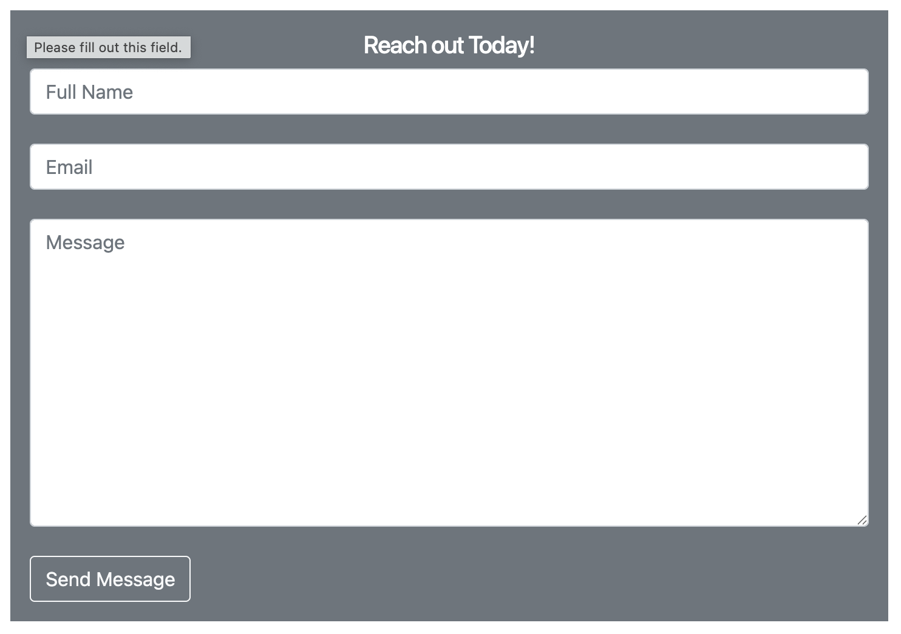

.. _delete:

Data deletion form
~~~~~~~~~~~~~~~~~~

The page allows participants to request permanent removal of their collected data from the JTrack system. 

To submit a request, users must provide:

- **Subject ID** — the identifier shown in the JTrack app  
- **Email** — for confirmation or follow-up  
- **Reason** — an explanation for the deletion request  

After submitting the form, the request is forwarded to the study team for
manual verification and processing. Data deletion begins once the request is
reviewed and approved.

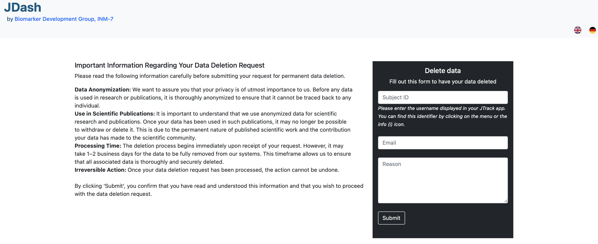

.. important::
   The data will be **permanently** removed and cannot be restored.
   Please make sure to provide the correct **Subject ID**.

.. _directcontacts:

Direct contacts
~~~~~~~~~~~~~~~

For collaboration enquiries and scientific questions you can contact Dr. Juergen Dukart or Dr. Mehran Turna.
For technical questions please contact `Jona M. Fischer <mailto:j.fischer@fz-juelich.de>`_ or `Mamaka Narava <mailto:m.narava@fz-juelich.de>`_

Studies 
---------------------------
Central hub for study management, showing all studies the user can access or create. Grid/List Toggle: Allows switching between study card and list layouts.
Search Bar: Filters displayed studies.

   * .. container:: quick-box plain

            **Interface Overview:**
   
            - :ref:`(1) – Create new study <create-study>`
            - :ref:`(2) – View study details <study-details-subjects-view>`
            - :ref:`(3) – Edit study <edit-study>`
            - :ref:`(4) – Test and audit logs <audit-study>`

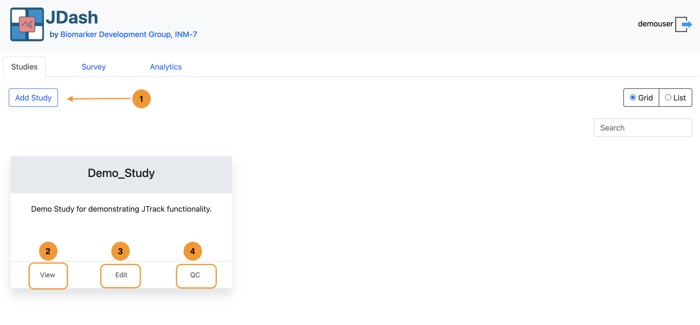

.. _create-study:

Create New Study
~~~~~~~~~~~~~~~~~~~~~~~~~~~~~~~~~~~~~~~~~~~~~~~~~~~~~~~~~~~~
The **New Study** form is used to configure and start a new data collection
project in JDash. Here you define basic metadata, sensor configuration,
optional EMA surveys, and experimental tasks.

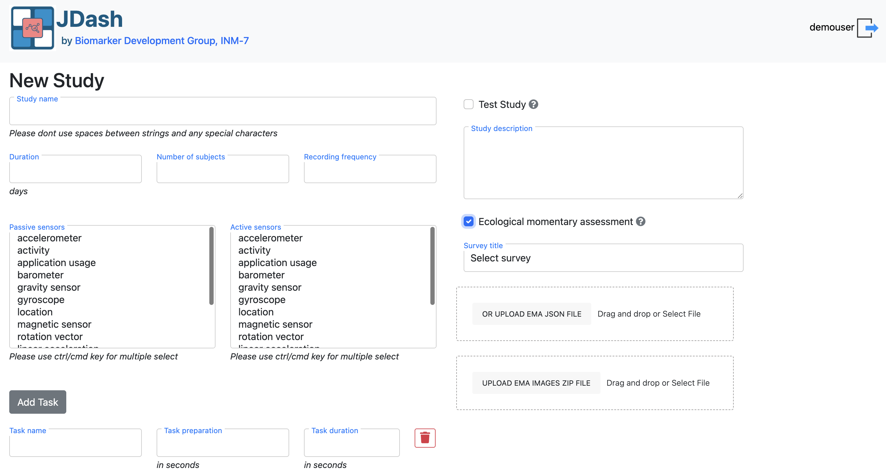

Form fields
~~~~~~~~~~~~~~~~~~~~~~~~~~~~~~~~~~~~~~~~~~~~~~~~~~~~~~~~~~~~

**Study name**

Unique identifier for the study.  
Do **not** use spaces or special characters (prefer ``MyStudy_01`` instead of
``My Study 01``).

**Test study**

Checkbox indicating whether this is a **test/pilot** study.

- Enabled: data are clearly marked as test data and can be discarded later.
- Disabled: study is treated as a regular production study.

**Study description**

Free-text description of the study purpose, protocol, cohort, or any notes for
administrators. This is not shown to participants.

**Duration**

Length of the study in **days**.  
Defines the time window during which study is active for each participant.

**Number of subjects**

Planned number of participants for this study.  
Used for planning and monitoring recruitment progress.

**Recording frequency**

Sampling rate for sensor data collection, expressed in **Hertz (Hz)**.  
This defines how many measurements are recorded per second.

.. note::

   Higher frequencies provide more detailed sensor data but may increase
   battery consumption and storage requirements. Choose a value appropriate
   for your study's goals and device performance limits.

**EMA (Ecological Momentary Assessment)**

Checkbox to enable or disable EMA for this study.

- Enabled: the study is linked to EMA survey.
- Disabled: no EMA questionnaires are used; only sensor data and tasks apply.
   - **Survey title**
      Dropdown to select an existing EMA survey that has been defined in the
      :ref:`create-survey` section.  
      This determines which questionnaire is delivered to participants.
   - **OR UPLOAD EMA JSON FILE**
      Drag-and-drop area or file picker to upload a **survey JSON** directly for
      this study.
      - Can be used instead of selecting an existing survey.
      - The JSON structure must follow the JDash/JTrack EMA schema.
   - **UPLOAD EMA IMAGES ZIP FILE**
      Drag-and-drop area or file picker to upload a **ZIP archive** containing
      image assets used in EMA questions (e.g., visual prompts).
      - Filenames in the ZIP must match the ``Image Url`` fields used in survey
      questions.

.. _conf-active-labeling:

**Sensor configuration**

**How to configure active labeling**

In **JDash**, study conductors can configure the **Active Labeling** feature to collect labeled sensor data for specific tasks or activities. This setup is essential when precise associations between sensor signals and user-performed tasks are required.

.. image:: image/JDash/ActiveLabeling.png
    :width: 600px
    :align: center

Within the study settings on **JDash**, you can:

- ✅ **Enable active labeling** for your study.
- 🎯 **Select the sensors** that should be recorded during active labeling sessions (e.g., accelerometer, gyroscope, microphone, etc.).
- 📝 **Define multiple labeling tasks**:

  - Each task has a 
      - **name** (e.g., ``Walking``, ``Brushing Teeth``),
      - **preparation time** (in seconds),
      - **duration** (in seconds).
      - **description/instructions** optional for participants.
  - These tasks will appear in the participant’s app as selectable activities during active labeling.

.. note::

   Active labeling will only be enabled if **active sensors** are selected in the configuration.

Example task list JSON:

.. code-block:: json

    [
      {
        "task_name": "Brushing Teeth",
        "task_duration": 30,
        "task_description": "Please simulate brushing your teeth for 30 seconds."
      },
      {
        "task_name": "Walking",
        "task_duration": 60,
        "task_description": "Walk normally in a straight line for one minute."
      }
    ]

This list is presented to participants inside the JTrack Social app with autocomplete, so tasks are standardized and consistent.

.. tip::

   Use descriptive task names and clear instructions to help participants understand what to do during each session.

Inside of JTrack Social, Active Labeling is then accessible from the Main view (both in :ref:`iOS <active-labeling-ios>` and Android).

.. _study-details-subjects-view:

Study Details 
~~~~~~~~~~~~~~~~~~~~~~~~~~~~~~~~~~~~~~~~~~~~~~~~~~~~~~~~~~~~

**Overview panel**

The panel (1) provides a quick snapshot of the study configuration.
It summarizes the most relevant study parameters so administrators can review
key settings at a glance.

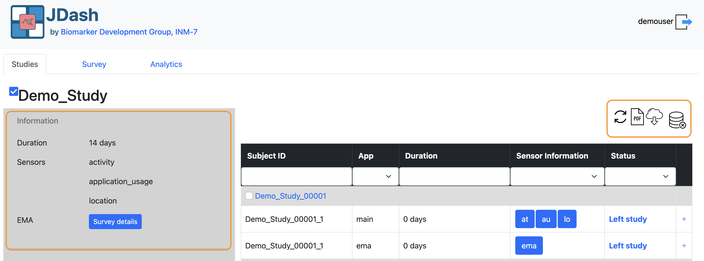

The panel displays:

- **Duration** — total length of the study in days  
- **Sensors** — list of passive and active sensors enabled for the study  
- **EMA** — indicator showing whether an EMA survey is assigned  
  (with a *Survey details* button to view the full questionnaire)

This section helps users verify that the study has been configured correctly
before adding participants or exporting data.

**Toolbar Panel**

The toolbar (2) contains shortcut actions for managing study-level
operations. These icons are located in the top-right corner of the Study
Details page.

The available actions typically include:

- **Refresh** — to update the data and view the current status of subjects/sensors
- **Export PDF** — generates a PDFs of QR codes of participant sheets that have not been used
- **Download Data** — triggers email to downlaod the collected sensor or EMA data  
- **Database Actions** — to delete subject data from the study and server
  (e.g., remove all data associated with the study)

These tools provide quick access to the most common administrative actions,
allowing study investigators to monitor progress, retrieve data, and perform
maintenance efficiently.

**Subject Table**

The table (1) displays all subjects associated with the
selected study. It provides an overview of each participant’s status, app
type, sensor configuration, and study duration.

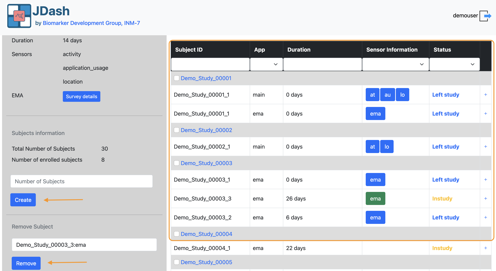

The table includes the following columns:

- **Subject ID** — the unique identifier assigned to each participant  
- **App** — indicates whether the entry belongs to the *main* app or the *EMA* app  
- **Duration** — number of days the participant has been in the study  
- **Sensor Information** — list of sensors enabled for that subject  
  (e.g., ``at`` = activity, ``au`` = application usage, ``lo`` = location)  
- **Status** — participant’s current state (e.g., *In study*, *Left study*)

Each subject may appear multiple times if both main and EMA configurations
exist for the same participant ID.

Filters above the table allow administrators to search by ID, filter by app
type, or filter by sensor usage. This panel is useful for monitoring study
progress, reviewing sensor connectivity, and identifying participants who have
left the study.

**Subject Management Panel**

The panel (2) allows administrators to add or remove
subjects from the study.

**Subject Information** 
   Displays high-level subject counts:

   - **Total Number of Subjects** — planned target number  
   - **Number of enrolled subjects** — participants currently created in the system  

**Create Subject** 
The section allows administrators to generate new subject IDs for the study.  
To add subjects enter the number of new subjects you want to create in the field  **Number of Subjects** and click **Create**.

.. note::

   The system automatically generates new subject QR codes following the study’s naming convention 
   (e.g., ``Demo_Study_00005``) which can downloaded from **Export PDF** toolbar panel.

**Remove User** 

This section allows administrators to remove a subject entry from the study.

To remove a subject, select the subject from the list and confirm the removal.

.. important::

   Removing a subject deletes it from the active study dashboard but does **not**
   remove historical data unless server-side deletion procedures are used.

.. _notifications:

**Notification**

The notification panel allows administrators to send custom push
notifications to selected study participants. This can be used for reminders,
announcements, troubleshooting instructions, or follow-up messages.

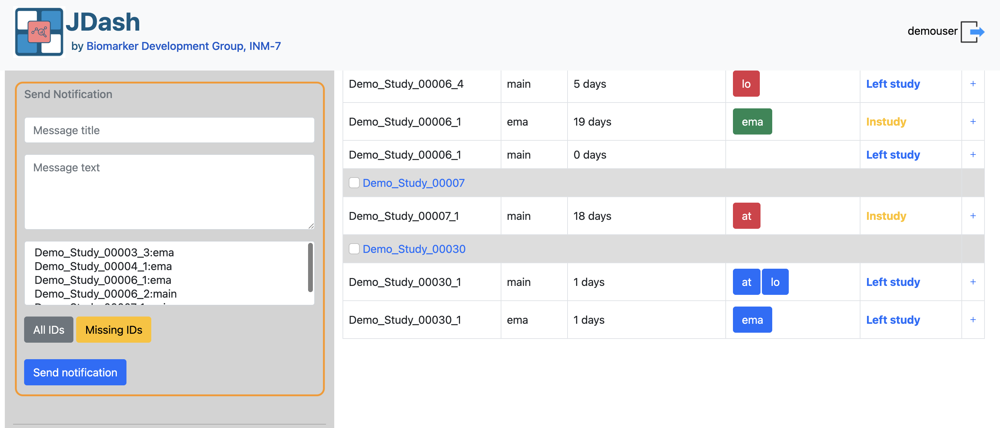

The panel contains the following fields:

- **Message title**  
  A short title or subject line that appears in the participant’s device
  notification.

- **Message text**  
  The main body of the notification. This can include instructions,
  reminders, or any relevant message content.

- **Recipients list**  
  This box displays the subject IDs that will receive the notification.
  Administrators can manually enter IDs or automatically populate the list
  using the buttons below.

Two shortcut buttons are provided:

- **All IDs** — fills the list with *all enrolled subjects* in the study  
- **Missing IDs** — fills the list with subjects who have not yet submitted
  recent data or have missing entries, depending on system configuration

After preparing the message and selecting recipients, click **Send
notification** to deliver the message to the participants’ devices.

.. important::
   Notifications are sent via the JTrack backend and delivered through the
   device’s native notification system. Delivery times may vary depending on
   network connectivity and device settings.

.. _study-closure:

**Close study**

This section allows investigators to formally end a study. Once
a study is closed, no new data will be accepted from enrolled participants.

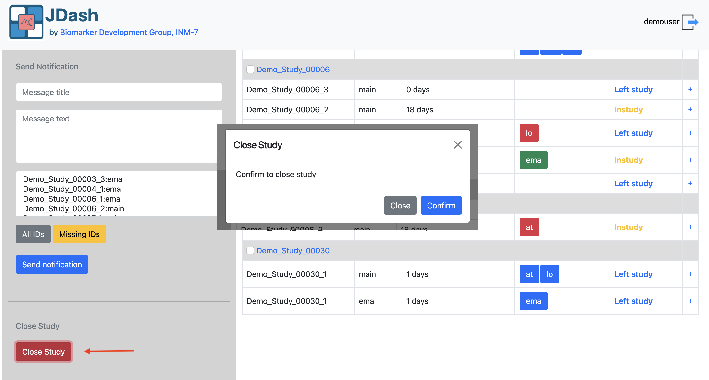

.. important::

   Closing a study does **not** delete existing data. All sensor and EMA data
   remain available in the server for export and analysis. However, once a
   study is closed, it will no longer be visible in the dashboard, and no
   further data collection will occur.

.. _edit-study:

Edit Study
~~~~~~~~~~~~~~~~~~~~~~~~~~~~~~~~~~~~~~~~~~~~~~~~~~~~~~~~~~~~
The **Edit Study** page allows investigators to modify an existing study’s
configuration, update sensor settings, change the assigned EMA survey, or
adjust task settings. This interface is identical to the *New Study* form,
but the fields are pre-filled with the study’s current values.

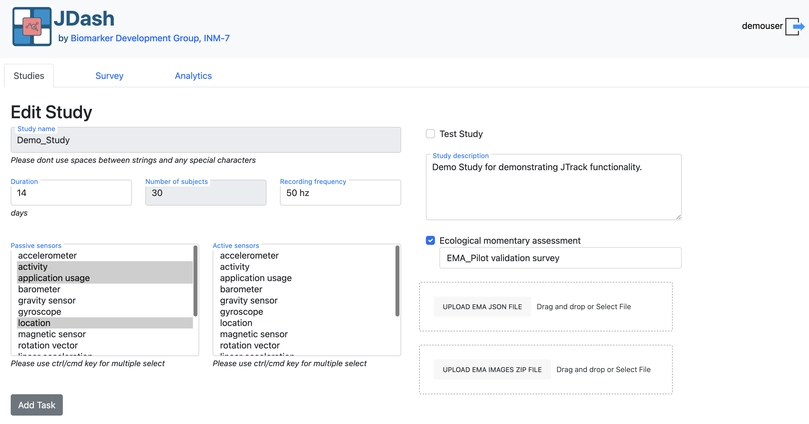

The following elements can be updated directly:

- **Number of subjects** To add more participants check **Create Subject** section
- **Duration**
- **Recording frequency**
- **Study description**
- **Passive sensors** and **active sensors** (multi-select lists)
- **EMA settings** (change the survey from list of surveys created, images ZIP upload)
- **Task list** (add, modify, or remove tasks)

All changes are immediately applied once you save the study.

.. note:: 
      The study name is fixed once the study is created and **cannot be changed**.
      It serves as the unique identifier for the study.

.. _audit-study:

Audit / Quality Control 
~~~~~~~~~~~~~~~~~~~~~~~~~~~~~~~~~

The Test checklist provides a structured way for investigators and
research teams to verify that a study is functioning as intended before and
during deployment. Each row represents a predefined test case that can be
checked directly within the dashboard.

This tool helps ensure data integrity, validate sensor activity, and confirm
that participant workflows behave correctly.

.. image:: image/JDash/dash_test_audit.png
    :width: 600px
    :align: center

The checklist displays the following information for each test case:

- **Admin**  
  Checkbox used by administrators to mark whether the test case is required
  or has been reviewed at an admin level.

- **Owner**  
  Checkbox indicating responsibility or completion for the test case by the
  assigned user or study owner.

- **Id**  
  Unique identifier for the test case.

- **Description**  
  A brief summary of what the test case is verifying (e.g., real-time
  monitoring, data export, participant enrollment).

- **Steps**  
  A detailed sequence of actions required to perform the test.  
  These may include navigation steps in JDash, using the JTrack app, scanning
  QR codes, or validating exported results.

- **Expected Outcome**  
  Describes what should occur if the test is successful.  
  This provides a reference for determining whether the system is behaving
  correctly.
  
.. note::

   Test case results do not affect participant data collection. The checklist
   is an internal quality-assurance tool used only for validation and study
   monitoring purposes.

Survey
---------------------------
Manages EMA (Ecological Momentary Assessment) questionnaires linked to studies. Displays existing surveys with title, study association, creation date, and actions (edit, copy, delete).
Upload Section: Allows importing survey definitions via JSON files.

   * .. container:: quick-box plain

            **Interface Overview:**
            
            - :ref:`(1) – Create Survey <create-survey>`
            - :ref:`(2) – Upload Survey Json <upload-survey-json>`
            - :ref:`(3) – Edit/View Survey <survey-edit-view>`
            
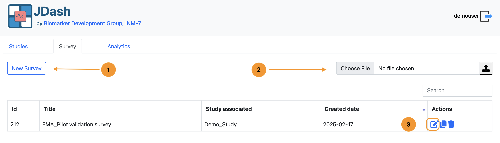

.. _create-survey:

Create Survey
~~~~~~~~~~~~~~~~~~~~~~~~~~~~~~~~~

The Survey module allows administrators to define and manage EMA (Ecological
Momentary Assessment) questionnaires that will be delivered to study
participants. Each survey contains a title, description, scrolling behaviour,
and associated question items uploaded later as a JSON file.

The *New Survey* dialog provides a guided form for creating a survey entry in
the system.

.. image:: image/JDash/dash_create_survey.png
    :width: 600px
    :align: center

Form fields
~~~~~~~~~~~~~~~~~~~~~~~~~~~~~~~~~~~~~~~~~~~~~~~~~~~~~~~~~~~~

**Title**  
   The display name of the survey. This name appears in the survey list and
   throughout the dashboard.

**Description**  
   A short explanation of the survey’s purpose, context, or intended use.
   This helps administrators distinguish between multiple surveys.

**Scroll type**  
   Defines how participants will navigate through the survey items within
   the JTrack EMA app. Two options are available:

   - **Horizontal** – Questions scroll left/right.  
     Suitable for one-question-per-screen layouts, swipe-based navigation,
     and compact mobile interfaces.

   - **Vertical** – Questions scroll top/bottom.  
     Suitable for longer pages, forms with multiple inputs, or free-text
     responses requiring more space.

   Select the option that best matches the design of your survey JSON file.

.. _upload-survey-json:

Upload Survey via JSON
~~~~~~~~~~~~~~~~~~~~~~~~~~~~~~~~~

Instead of creating a survey manually through the dialog, you can create a
new survey by **uploading a JSON definition file**. The JSON file must follow
the JDash/JTrack EMA survey schema.

The JSON must:

- Be valid UTF-8 encoded JSON.
- Follow the JDash survey schema (field names and structure).
- Define at least the survey metadata and a list of items/questions.

**Sample JSON format**

A sample format file is provided (for example: ``sample_survey.json``).  
Use this as a template when creating new surveys:

.. code-block:: json

   {
     "title": "EMA Pilot validation survey",
     "description": "Short description of the survey purpose and context.",
     "scroll_type": "H",   // or "V"
     "topN": -1
     "questions": [
       {
         "id": "1",
         "active": 1,
         "title": "How are you feeling right now?",
         "subText": "How did you sleep last night?",
         "frequency": 1,
         "clockTime": 0,
         "clockTime_start": "480",
         "clockTime_end": "1430",
         "nextDayToAnswer": 0,
         "category": 1,
         "imageURL": "",
         "url": "",
         "questionType": 3,
         "deactivateOnAnswer": "",
         "deactivateOnDate": 0,
         "activate_question": "",
         "deActivate_question": "",
         "activation_condition": "",
         "deActivation_condition": "",
         "answer": [
                {
                    "id": 1,
                    "text": "",
                    "subText": "",
                    "value": 0.1,
                    "defaultValue": 5.0,
                    "stepSize": 1.0,
                    "minVal": 0.0,
                    "maxVal": 10.0,
                    "minText": "Schlecht | Bad",
                    "maxText": "Gut | Good"
                }
            ]
       }
       // additional items ...
     ]
   }

When preparing a new survey, copy the provided sample JSON file and adapt:

- ``title`` and ``description`` to your study.
- ``scroll_type`` to match the intended navigation style.
- The ``questions`` list to include all questions, response options, and any
  additional fields required by the schema.

.. important::

   Only JSON files following this structure will be accepted and correctly rendered by the JTrack EMA app.

.. _survey-edit-view:

Survey Details View
~~~~~~~~~~~~~~~~~~~~~~~~~~~~~~~~~

After creating or uploading a survey, selecting it from the Survey list opens
the **Survey Details** page. This page displays all questions defined for the
survey and provides tools for managing categories, adding new questions, and
exporting the survey as JSON.

.. image:: image/JDash/dash_survey_details.png
    :width: 600px
    :align: center

**Overview of the Question List**

The table shows all survey questions in a structured format. Each row
represents a single question and includes:

- **id** — The internal question identifier (order in the survey).  
- **title** — The primary question text (German example shown).  
- **subText** — The secondary text .  
- **questionType** — Input type (e.g., Free Number, Single Choice, Multiple Choice).  
- **category** — Category assigned to the question (e.g., IHG, GH).  
- **frequency** — How often the question is shown in days.  
- **clockTimeStart / clockTimeEnd** — Valid times to receive reminder notification to answer the question.  
- **nextDayToAnswer** — day when the questions becomes available to answer.

This view allows users to quickly review the full content of the survey and to
edit or organize items as needed.

**Categories Management**

The **Categories** button opens the category management dialog. Categories help group questions into logical sections and are required for
surveys with thematic organization (e.g., "Mobility", "Digital Use").
Investigators can:

- Create new categories  
- Rename existing categories  
- Delete categories

.. image:: image/JDash/survey_category.png
    :width: 600px
    :align: center

**Adding New Questions**

Click **New Question** to add a new item to the survey.  
This opens the question editor, where you can define all properties of the
question (text, type, category, scheduling rules, etc.).

For a full description of all editable fields, check :ref:`Create /Edit Question <question-form>`

Once the question is saved:

- It appears immediately in the question list
- It can be edited, duplicated, or deleted through the action buttons on the right

This workflow ensures that new survey items follow the same structure and
validation rules as existing ones.

**Downloading the survey JSON**

The download icon (⬇) in the top-right corner of the page exports the entire
survey definition as a JSON file. This JSON can be used for:

- Backups  
- Versioning  
- Editing offline  
- Sharing surveys between studies

**Row Actions (per item)**

Each question row includes three action buttons:

**✏️ Edit**  
   Opens the question editing dialog.  
   Allows modification of text, category, type, time window, and all properties.

**📄 Copy / Duplicate**  
   Creates a new question using the selected item as a template.  
   Useful when building surveys with repeated or similar formats.

**🗑️ Delete**  
   Removes the question from the survey.  
   A confirmation prompt prevents accidental deletion.

.. _question-form:

Create / Edit Question
~~~~~~~~~~~~~~~~~~~~~~~~~~~~~~~~~

The Question Editor allows investigators to define or modify a single survey
question within the EMA survey. Each field controls a specific aspect of how
the question behaves, how it appears to the user, and when it is shown.

.. image:: image/JDash/survey_edit_question.png
    :width: 600px
    :align: center

**Form fields**

Below are the descriptions of all fields available in the Create/Edit Question
form.

**Sequence Id**

The position of the question in the survey.  
Questions are displayed in ascending order based on this value.

**Type**

Specifies the question type (e.g., Free Number, Single Choice, Multiple Choice,
Free Text, Slider).  
The selected type determines how the question is rendered in the participant
application.

**Title**

The main question text shown to participants (e.g., in German or the primary
study language).

**Description**

Additional descriptive text, explanation, or translation shown below the main
question.  
Useful for bilingual surveys or questions needing clarification.

**Use default values toggle**

When disabled, all values must be filled manually. If enabled, system-defined default values are used for:

- Frequency  
- NextDayToAnswer  
- ClockTimeStart  
- ClockTimeEnd  
- DeactivateOnDate  

**Category**

A numeric category label used to group questions into thematic clusters.  

.. admonition:: Example:

   - 1 - Mobility  
   - 2 - Digital Activity  
   - 3 - Sleep  
   - 4 - Mood

**Frequency**

Defines how often the question is shown.

.. admonition:: Values:

   - **0** — Ask at any time the user opens the survey  
   - **1** — Ask every day  
   - **n** — Ask every *n* days (e.g., 2 = every second day)

**NextDayToAnswer**

Controls on which study day this question first becomes available.

.. admonition:: Examples:

   - **0** — Starts on day 0  
   - **1** — Starts on day 1  
   - **5** — Question begins appearing on day 5  

**DeactivateOnAnswer**

If set, the question will be skipped or hidden in future survey sessions after
a specific answer value is selected.  
Commonly used to disable follow-up items after a “No” response.

**DeactivateOnDate**

Defines a study day after which the question should no longer be shown.

.. admonition:: Example:

   - **0** — No deactivation by date  
   - **10** — Question disappears after day 10 of the study

**Activate Question**

A comma-separated list of Sequence Ids for questions to activate if this
question is answered.

.. admonition:: Example:

   - ``1``  
   - ``2,3``

This enables branching logic (conditional question activation).

**Deactivate Question**

A comma-separated list of Sequence Ids for questions that should be disabled
when this question is answered.  
Used for mutually exclusive question pathways.

**ClockTime Start**

The time (in minutes from midnight) when the question becomes active.

.. admonition:: Examples:

   - **480** = 08:00  
   - **900** = 15:00

If multiple times are provided (comma-separated), the user will receive
multiple activations.

**ClockTime End**

The time (in minutes since midnight) when the question becomes inactive.

Must match the number of entries in ClockTime Start if multiple values are
used.

.. admonition:: Example:

   - **1430** = 23:50  
   - ``480,900`` must have a matching ``600,1000`` (start/end pairs)

**Image URL**

An optional image filename associated with the question (e.g., ``image1.png``).
This image must exist in the app’s configured image directory.

**URL**

An optional external link related to the question (e.g., informational page,
instructions, consent wording).  
The link appears below the question text in the app.

.. _answer-form:

Create / Edit Answer
~~~~~~~~~~~~~~~~~~~~~~~~~~~~~~~~~
For question types that require predefined answer options (such as
**Single Choice**, **Multiple Choice**), the Question
Editor displays an **Answer Form** section. This section allows the
investigators to define the selectable choices shown to participants.

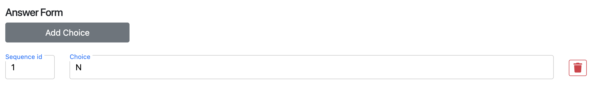

Click **Add Choice** to insert a new answer option row.  
Each row contains two fields:

**Sequence Id**  
   The display order of the option. Choices appear in ascending order based on
   this value.

**Choice**  
   The text label shown to the participant (e.g., *Yes*, *No*, *Often*, *Rarely*, etc.).

.. admonition:: Example:
 
   - ``1 → Less than 10 minutes``  
   - ``2 → 10–30 minutes``  
   - ``3 → More than 30 minutes``  

**Deleting a choice**

To remove an answer option, click the **trash icon** (🗑️) on the right side of
the row.  
The option is removed immediately from the form.

.. Analytics
.. ---------------------------
.. Integrates Plotly-Dash applications for data visualization and analysis. Users can select from available Dash apps to explore study data through interactive graphs and dashboards.

..    :widths: 40 60
..    :header-rows: 0
..    :align: left
..    :class: two-col-plain

..    * - .. container:: quick-box plain

..             **Interface Overview:**
            
..             - :ref:`(1) – Select Dash App <select-dash-app>`
..             - :ref:`(2) – Dash App View <dash-app-view>`

..      - .. image:: image/JDash/dash_analytics.png
..           :width: 100%
..           :alt: JDash analytics

.. .. _select-dash-app:

.. **Default view**

.. .. _dash-app-view:

.. **Project specific view**

Codebase Structure
++++++++++++++++++++++++++++++++++++++++++++++++++
.. code-block:: text

   JTrack-dashboard/
   ├─ admin/               # Django "apps" implementing UI + logic
   ├─ jdash/               # Django project configuration
   ├─ static/              # Global static assets
   ├─ jtrack.sql           # Example SQL schema/data (MySQL or similar)
   ├─ manage.py            # Django management entry point
   ├─ requirements.txt     # Python dependencies
   ├─ setup.sh             # Setup helper script
   ├─ setup_mysql.sh       # MySQL setup helper script
   └─ README.md

admin/ – Django Project
--------------------------------------
This directory contains core Django project settings and runtime configuration.

**Key Files**

- settings.py : Defines installed apps, database configuration, static settings, security settings.
- urls.py: Routes requests to all dashboard modules (studies, surveys, notifications, analytics).
- wsgi.py: WSGI entry point used by Apache mod_wsgi in production.
- asgi.py: ASGI entry point (not used by Apache, but available for async servers).

jdash/ – Dashboard Application
--------------------------------------
Contains Django apps that implement the dashboard functionality:

**Modules**

- Login module – Authentication and access control.
- Studies module – Create/edit studies, manage sensors, manage subjects.
- Survey module – EMA survey creation and management.
- Notifications module – Push notifications to participants.
- Analytics module – Embeds visual analytics (optional Dash integration).

**Each app typically contains:**

- models.py — Study, survey, sensor, subject, notification models
- views.py — View logic for HTML pages and APIs
- urls.py — App-level router
- forms.py — Django forms for data input
- templates/<app_name>/ — HTML templates (Bootstrap-based)
- static/<app_name>/ — Local static assets

static/
--------------------------------------
Contains global project-level assets:

- CSS styling for dashboard UI
- JavaScript (Bootstrap, BootstrapTable, custom JS)
- Icons, logos, images

These are collected via collectstatic into STATIC_ROOT for Apache serving.

Deployment Instructions
++++++++++++++++++++++++++++++++++++++++++++++++++

How to deploy the JTrack Dashboard both locally
(for development) and on a production web server using Apache and
``mod_wsgi``.

Local Deployment (Development)
---------------------------------

Local deployment is intended for development, testing, and debugging.
Django’s built-in development server is used for this mode.

Requirements
~~~~~~~~~~~~~~~~~~~~~~~~~~~~~~

Install system prerequisites:

.. code-block:: bash

    sudo apt update
    sudo apt install python3 python3-venv python3-pip git

Clone the repository:

.. code-block:: bash

    git clone https://github.com/mamaka7/JTrack-dashboard.git
    cd JTrack-dashboard

Create Virtual Environment
~~~~~~~~~~~~~~~~~~~~~~~~~~~~~~

.. code-block:: bash

    python3 -m venv venv
    source venv/bin/activate

Install dependencies:

.. code-block:: bash

    pip install --upgrade pip
    pip install -r requirements.txt

(Optional):

.. code-block:: bash

    chmod +x setup.sh
    ./setup.sh

Database Setup (MariaDB)
~~~~~~~~~~~~~~~~~~~~~~~~~~~~~~

For both local development and production, the recommended database is
**MariaDB**. A helper script is provided to set up the database and
user automatically.

Make sure MariaDB is running:

.. code-block:: bash

    sudo systemctl enable mariadb
    sudo systemctl start mariadb

Run the MariaDB setup script from the project root:

.. code-block:: bash

    chmod +x mysql_set.sh
    ./setup_mysql.sh

The script typically:

- Creates a MariaDB database (e.g. ``jtrack``)
- Creates a DB user with the required privileges
- Optionally imports the schema/data from ``jtrack.sql``

After the script finishes, apply Django migrations (still recommended):

Apply migrations:

.. code-block:: bash

    python manage.py migrate

Run Development Server
~~~~~~~~~~~~~~~~~~~~~~~~~~~~~~

Start Django's built-in server:

.. code-block:: bash

    python manage.py runserver

Then open in a browser:

``http://127.0.0.1:8000``

In this mode:

- Debug is active  
- Auto-reload is enabled  
- No Apache or external web server is required  

Production Deployment (Apache + mod_wsgi)
------------------------------------------------------------------

This method is recommended for real-world hosting of the JTrack Dashboard.

Prerequisites
~~~~~~~~~~~~~~~~~~~~~~~~~~~~~~

Install required packages:

.. code-block:: bash

    sudo apt update
    sudo apt install python3 python3-venv python3-pip \
                     apache2 libapache2-mod-wsgi-py3 git

Clone Application into Server Directory
~~~~~~~~~~~~~~~~~~~~~~~~~~~~~~~~~~~~~~~~~~~~~~~~~~~~~~~~~~~~

Example installation directory: ``/srv/jdash``

.. code-block:: bash

    sudo mkdir -p /srv/jdash
    sudo chown $USER:$USER /srv/jdash
    cd /srv/jdash

    git clone https://github.com/mamaka7/JTrack-dashboard.git .

Create Virtual Environment
~~~~~~~~~~~~~~~~~~~~~~~~~~~~~~~~~~~~~~~~~~~~~~~~~~~~~~~~~~~~

.. code-block:: bash

    python3 -m venv venv
    source venv/bin/activate
    pip install -r requirements.txt

Database Setup (MariaDB)
~~~~~~~~~~~~~~~~~~~~~~~~~~~~~~~~~~~~~~~~~~~~~~~~~~~~~~~~~~~~

First, run the MariaDB setup script from the project root
(e.g. ``/srv/jdash``):

.. code-block:: bash

    cd /srv/jdash
    chmod +x setup_mysql.sh
    ./setup_mysql.sh

(or, if your script is named ``mysql_set.sh``:)

.. code-block:: bash

    chmod +x mysql_set.sh
    ./mysql_set.sh

This script should:

- Create the MariaDB database (e.g. ``jtrack``)
- Create a MariaDB user with password
- Grant required privileges
- Optionally import ``jtrack.sql``

Now open ``jdash/settings.py`` and ensure the MariaDB configuration is set.
MariaDB is fully compatible with the MySQL Django backend:

.. code-block:: python

    DATABASES = {
        "default": {
            "ENGINE": "django.db.backends.mysql",  # MariaDB-compatible
            "NAME": "jtrack",
            "USER": "jtrack_user",
            "PASSWORD": "securepassword",
            "HOST": "localhost",
            "PORT": "3306",
        }
    }

Also set production options:

**Disable DEBUG**

.. code-block:: python

    DEBUG = False

**Set Allowed Hosts**

.. code-block:: python

    ALLOWED_HOSTS = ["your-domain.com", "127.0.0.1"]

Apply migrations (even if the script imported the base schema):

.. code-block:: bash

    python manage.py migrate

Collect Static Files
~~~~~~~~~~~~~~~~~~~~~~~~~~~~~~~~~~~~~~~~~~~~~~~~~~~~~~~~~~~~

Set:

.. code-block:: python

    STATIC_ROOT = "/srv/jdash/static_collected"

Collect static assets:

.. code-block:: bash

    python manage.py collectstatic

Configure Apache (mod_wsgi)
~~~~~~~~~~~~~~~~~~~~~~~~~~~~~~~~~~~~~~~~~~~~~~~~~~~~~~~~~~~~

Create:

``/etc/apache2/sites-available/jdash.conf``

.. code-block:: apache

    <VirtualHost *:80>
        ServerName your-domain.com

        Alias /static/ /srv/jdash/static_collected/
        <Directory /srv/jdash/static_collected/>
            Require all granted
        </Directory>

        <Directory /srv/jdash/jdash>
            <Files wsgi.py>
                Require all granted
            </Files>
        </Directory>

        WSGIDaemonProcess jdash python-path=/srv/jdash \
                          python-home=/srv/jdash/venv
        WSGIProcessGroup jdash
        WSGIScriptAlias / /srv/jdash/jdash/wsgi.py

        ErrorLog ${APACHE_LOG_DIR}/jdash_error.log
        CustomLog ${APACHE_LOG_DIR}/jdash_access.log combined
    </VirtualHost>

Enable the site:

.. code-block:: bash

    sudo a2enmod wsgi
    sudo a2ensite jdash.conf
    sudo systemctl reload apache2

(Optional) Disable default Apache site:

.. code-block:: bash

    sudo a2dissite 000-default.conf
    sudo systemctl reload apache2

Enable HTTPS (Recommended)
~~~~~~~~~~~~~~~~~~~~~~~~~~~~~~~~~~~~~~~~~~~~~~~~~~~~~~~~~~~~

Use Let’s Encrypt:

.. code-block:: bash

    sudo apt install certbot python3-certbot-apache
    sudo certbot --apache -d your-domain.com