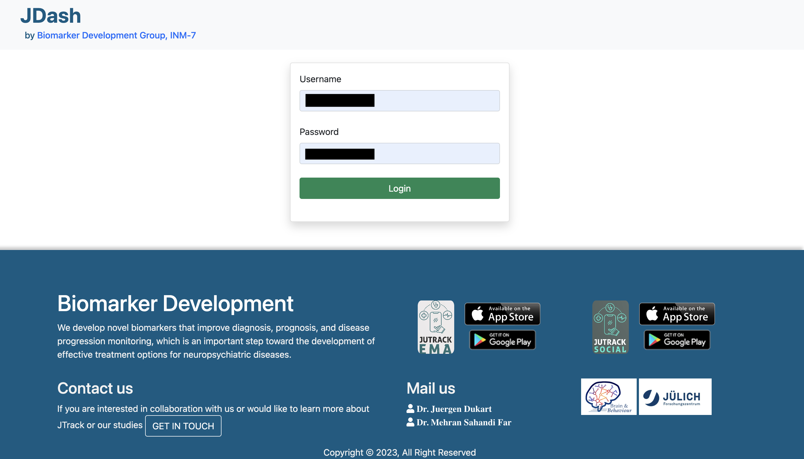
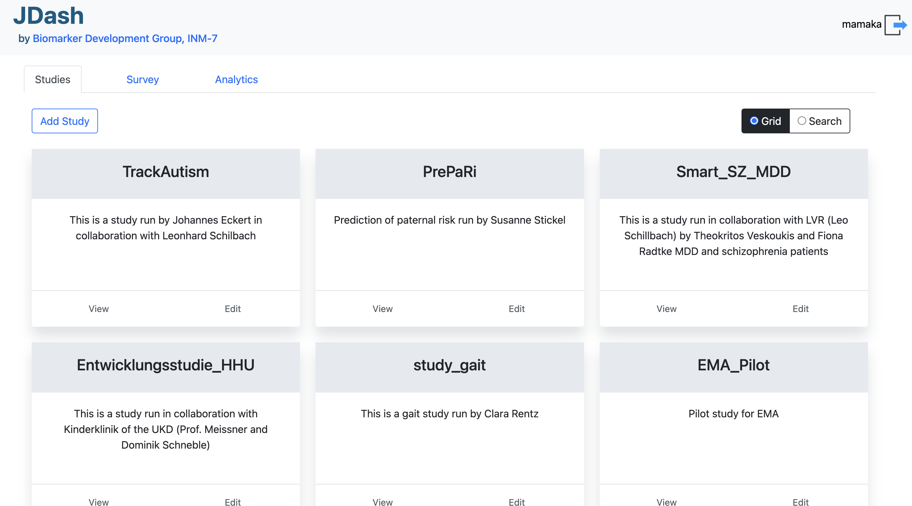
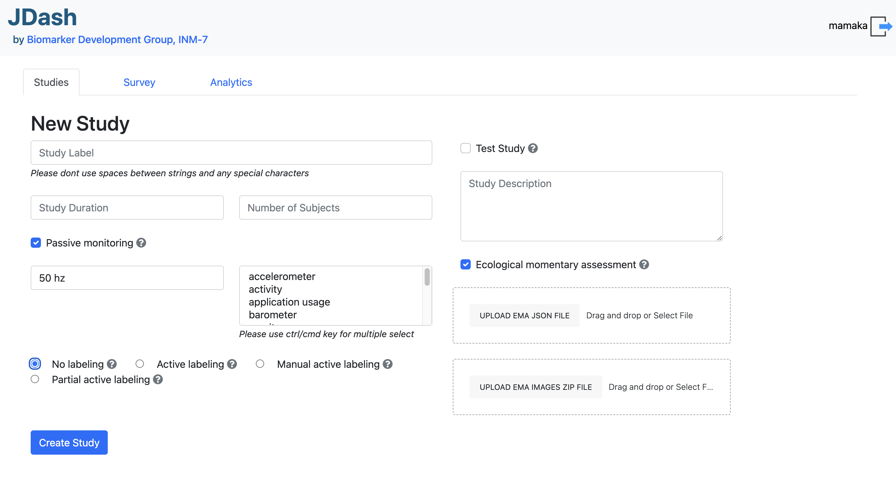
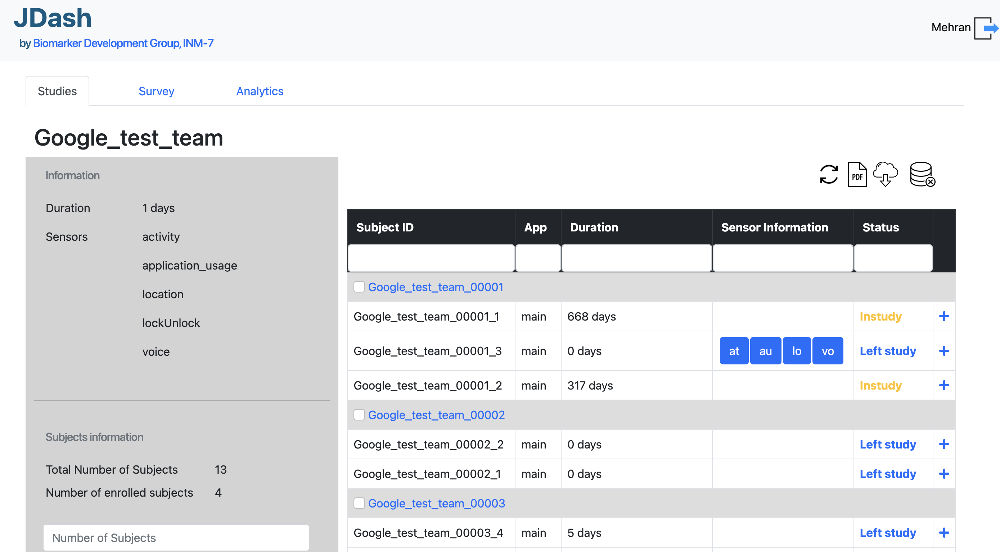
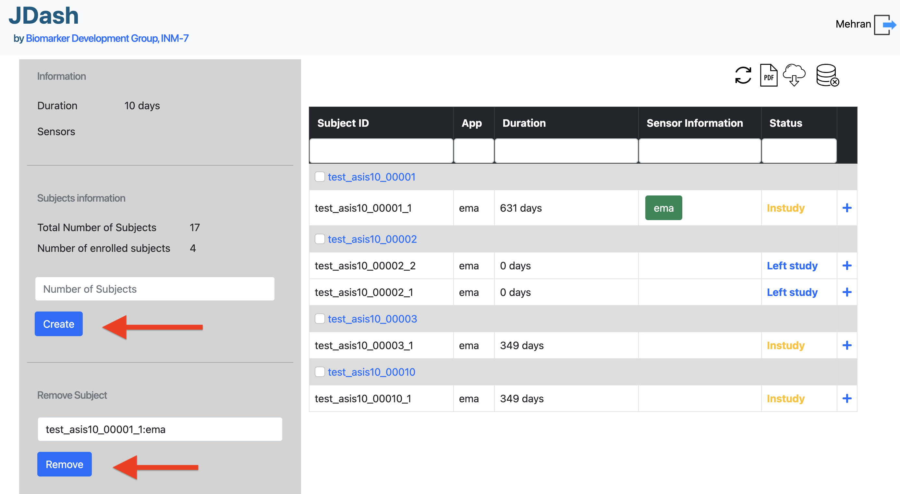
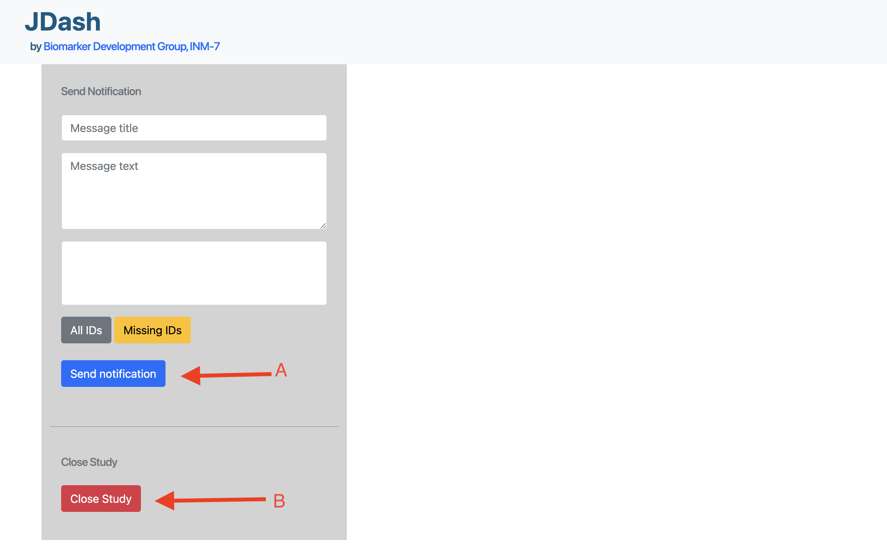

=====================
JTrack Dashboard
=====================

General
------------

* JDash is a web app built with the Django framework combined with `Dash <https://dash.plotly.com>`_ for . 
* It provides several functionalities that are necessary for creating, viewing and closing studies currently initiated by clinical institutions and the `Biomarker Development Group <https://www.fz-juelich.de/inm/inm-7/DE/Forschung/Biomarkerentwicklung/artikel.html?nn=653672>`_.

How  to Use
-----------

* **(a)** Visit `https://jdash.inm7.de <https://jdash.inm7.de/>`_.
* **(b)** Enter your personal credentials into the login fields and press **'Login'**.

* **(c)** After logging in the menu buttons are available for navigation.

THe user can create new studies  

|

Create a new study
++++++++++++++++++

* **(a)** Navigating to **Create Study** directs to an empty mask for creating a new study.

|

View an ongoing study
+++++++++++++++++++++

* **(a)** Selecting a study results in displaying all relevant information (general information, sent data information) and the options to send push notifications, to remove users from the study manually and to download participant sheets.

|

.. important:: Click **'Download unused study sheets'** to download participant sheets that were not used yet.
.. important:: In **Push notifications** section fill out title, message and reveicer list in order to send a notification to chosen receivers.
.. important:: In **Remove user** section select an user to remove him/her from the study (*Confirmation needed*).

Close an ongoing study
++++++++++++++++++++++

* **(a)** Navigating to **Close Study** directs to an empty dropdown list containing all ongoing studies that can be closed.

* **(b)** Selecting a study and pressing **'Close study'** below closes (i. e. moves it to the archive) the study (*Confirmation needed*).
