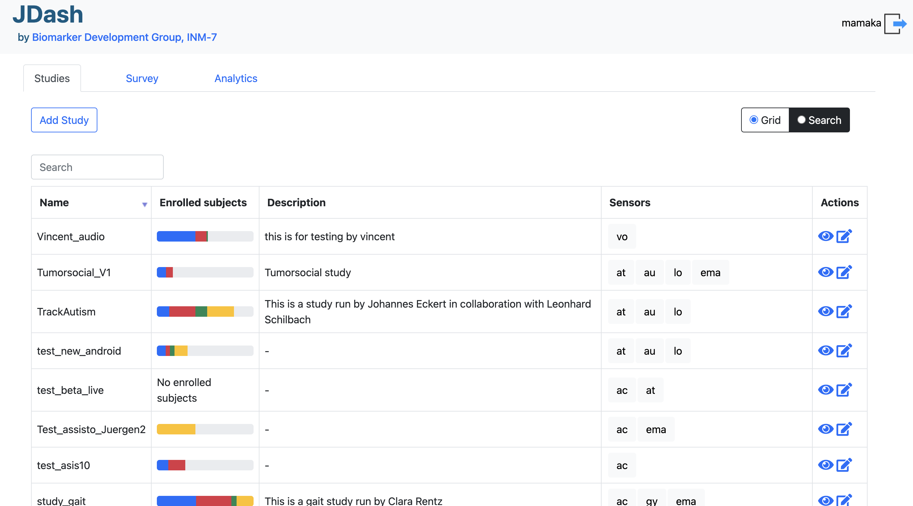
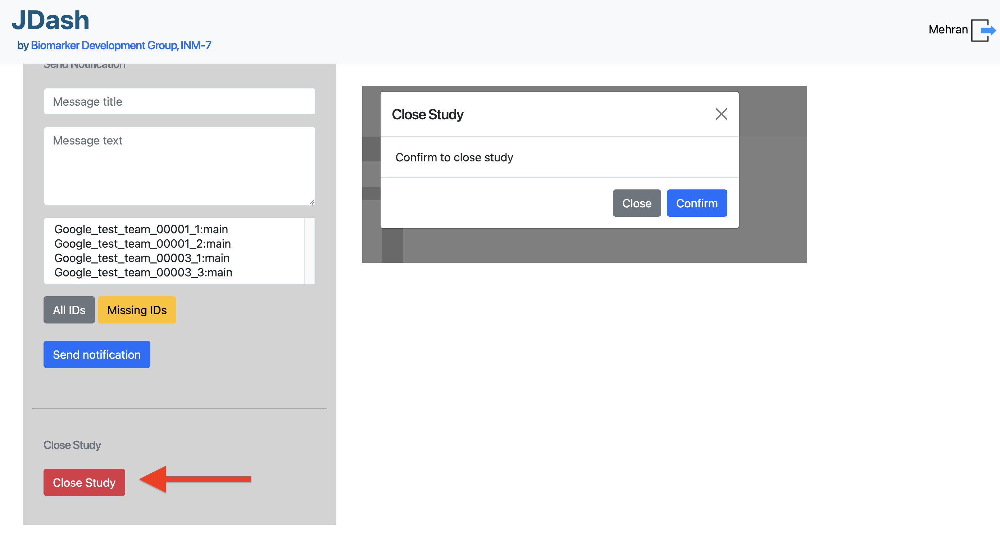
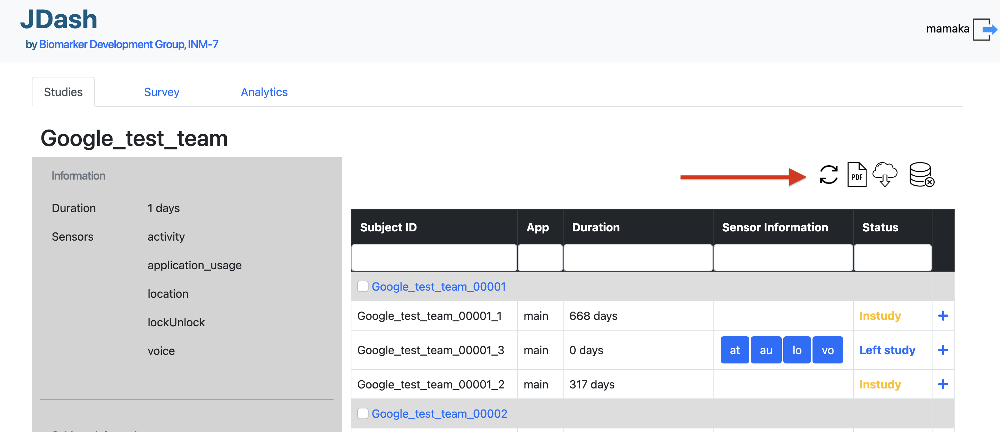

========================
JDash – JTrack Dashboard
========================

* JDash is a web app built with the Django framework combined with `Dash <https://dash.plotly.com>`_ for analysis purposes.
* It provides several functionalities necessary for creating, viewing, and closing studies initiated by clinical institutions and the `Biomarker Development Group <https://www.fz-juelich.de/inm/inm-7/DE/Forschung/Biomarkerentwicklung/artikel.html?nn=653672>`_.

Features
++++++++

Set Up
++++++

Environment
-----------

To use the starter, Python 3 should be installed properly on your workstation.
If you are not sure if Python is installed, open a terminal and type:

.. code-block:: shell

   python --version

Here is the full list of dependencies and tools required to build the app:

- **Python 3** – the programming language used to code the app
- **Git** – used to clone the source code from the GitHub repository

Manual Build
------------

Download the code:

.. code-block:: shell

   git clone https://github.com/Biomarker-Development-at-INM7/JTrack-dashboard.git
   cd JTrack-dashboard

Set Up for Unix/macOS
----------------------

Install modules via virtual environment:

.. code-block:: shell

   virtualenv jdash
   source jdash/bin/activate
   pip3 install -r requirements.txt

Set Up Database:

.. code-block:: shell

   python manage.py collectstatic
   python manage.py makemigrations
   python manage.py migrate

Start the app:

.. code-block:: shell

   python manage.py runserver

At this point, the app runs at:

:literal:`http://127.0.0.1:8000/`

Manage App Users
----------------

By default, the starter is not provided with users. To access the private pages and the admin section (reserved for superusers), follow the steps below.

**Create Superusers**

To access the admin section, Django requires superuser privileges. Let's create a new superuser:

.. code-block:: shell

   python manage.py createsuperuser

Once the superuser is successfully created, you can access the admin section at:

:literal:`http://localhost:8000/admin/`

**Create Groups**

- Administrator
- Investigator
- Viewer

**Create Users**

(Instructions to create users can be added here.)

Codebase Structure
------------------

(Provide details about the codebase structure here.)

Deploy on Webserver
-------------------

(Add instructions for deployment here.)

Using the Dashboard
+++++++++++++++++++

Login Page
-----------

.. image:: image/dash_index.png
   :width: 600px
   :align: center

.. raw:: html

   

     <strong>Quick access:</strong>
     <ul>
       <li><a href="#login" style="color: var(--color-link); text-decoration: none;">(1) – Login form</a></li>
       <li><a href="#language" style="color: var(--color-link); text-decoration: none;">(2) – Language switcher</a></li>
       <li><a href="#contact" style="color: var(--color-link); text-decoration: none;">(3) – Contact form</a></li>
       <li><a href="#delete" style="color: var(--color-link); text-decoration: none;">(4) – Data Deletion form</a></li>
       <li><a href="#directcontacts" style="color: var(--color-link); text-decoration: none;">(5) – Direct contacts</a></li>
     </ul>
   

.. _login:

**(1) Logging in**

* Visit `https://jdash.inm7.de <https://jdash.inm7.de/>`_
* Enter your personal credentials into the login fields and press **"Login"**.
* You can find your login credentials inside a PDF-file that was sent to you via email.

.. _language:

**(2) Switch language**

To change the language of the website please click on the respective flag.
Currently only German and English are supported. Additional languages will be added in the future.

.. _contact:

**(3) Contact form**

For general enquiries and messages, please use the provided contact form that appears after clicking the button.

.. image:: image/dash_contactform.png
   :scale: 30 %
   :align: center

.. _delete:

**(4) Data Deletion Request**

When a participant requests his/her data to be deleted, click this link to open our Data Deletion Request form.

.. image:: image/dash_data_deletion_form.png
   :width: 600px
   :align: center

.. important::
   The data will be **permanently** removed and cannot be restored.
   Please make sure to provide the correct **Subject ID**.

.. _directcontacts:

**(5) Direct Contacts**

For collaboration enquiries and scientific questions you can contact Dr. Juergen Dukart or Dr. Mehran Turna.
For technical questions please contact `Jona M. Fischer <mailto:j.fischer@fz-juelich.de>`_ or `Mamaka Narava <mailto:m.narava@fz-juelich.de>`_

Landing Page
-------------

**Studies**

* View all studies in a grid view.

.. image:: image/dash_logged_in.png
   :width: 600px
   :align: center

* View all studies in a search view.

**Survey**

Shows all surveys in a search view.

**Analytics**

Shows a selection of all studies available for Analytics.

Studies
--------

**Create a New Study**

* **(a)** Navigating to **Create Study** opens an empty form to create a new study.

.. image:: image/dash_create_empty.png
   :width: 600px
   :align: center

|

**View an Ongoing Study**

* **(a)** Selecting a study displays all relevant information (general info, sent data) and options to:
  - Send push notifications
  - Remove users manually
  - Download participant sheets

.. image:: image/dash_display_study.png
   :width: 600px
   :align: center

|

**Close an Ongoing Study**

* **(a)** Navigating to **Close Study** displays a dropdown list of ongoing studies that can be closed.
* **(b)** Selecting a study and pressing **"Close Study"** moves it to the archive (**confirmation needed**).

**Side-panel Features**

* **(a)** Click **"Refresh"** to update the data and view the current status of subjects/sensors.
* **(b)** Click **"Download unused study sheets"** to download participant sheets that have not been used.
* **(c)** Click **"Download Data"** to download study data.
* **(d)** Click **"Delete Subjects"** to delete subject data from the study and server.

.. important::
   In the **Push Notifications** section, fill out the title, message, and receiver list to send a notification to selected recipients.

.. image:: image/dash_send_notification.png
   :width: 600px
   :align: center

**Create / Remove Subjects**

.. important::
   In the **Remove User** section, select a user to remove them from the study (**confirmation needed**).

.. image:: image/dash_create_remove_subjects.png
   :width: 600px
   :align: center

Survey
------

**Create / Edit Survey**

**Create / Edit Category**

**Create / Edit Question**

**Create / Edit Answer**

(Add details about the survey functionality here.)