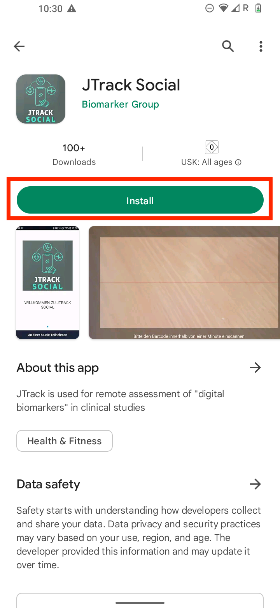
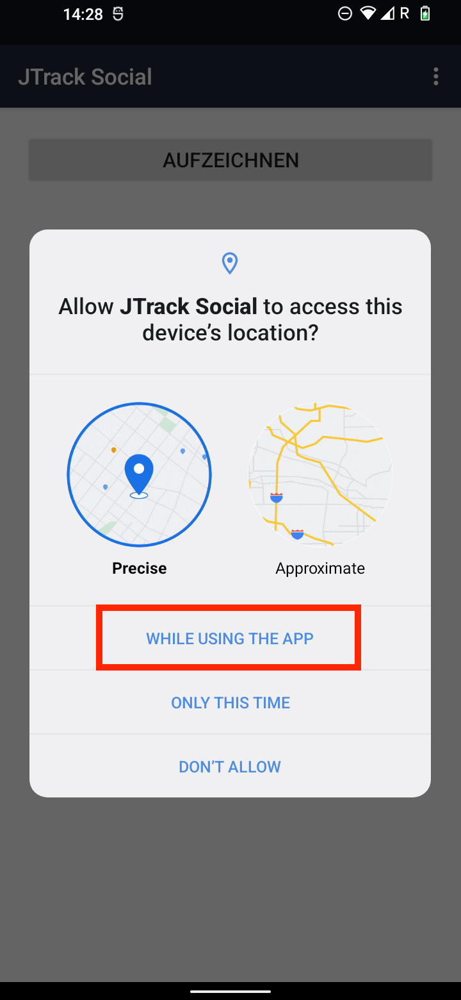
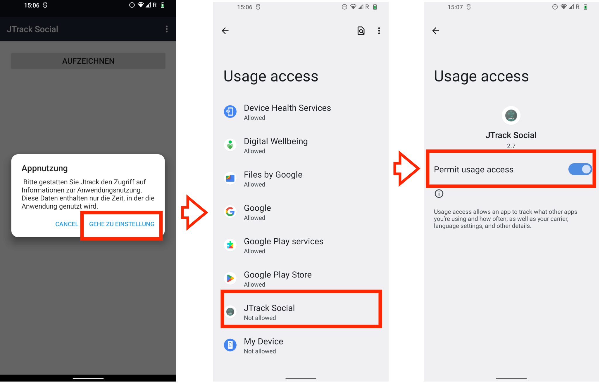
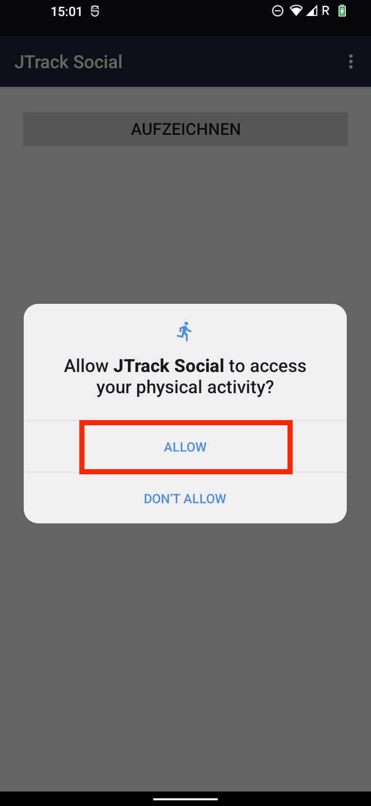
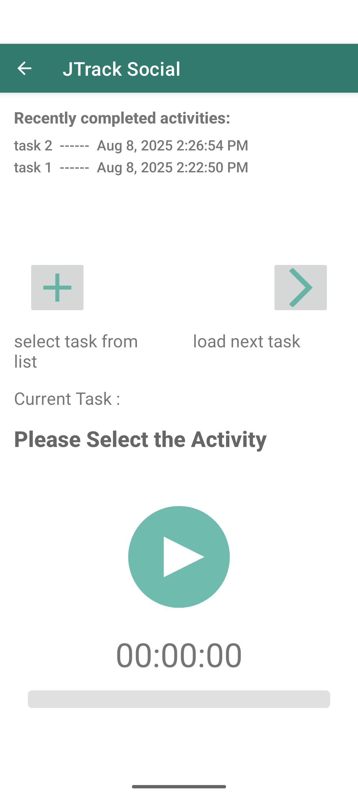
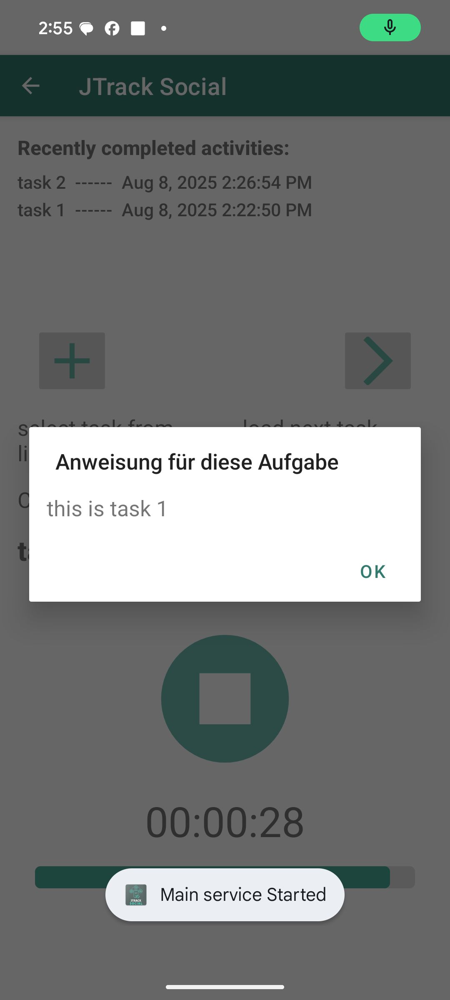

=====================
JTrack Social
=====================

JTrack Social is available for **Android** and **iOS**:

- In the `Google Play Store <https://play.google.com/store/apps/details?id=inm7.JTrack.JTrack_Social>`__
- In `Apple's App Store <https://apps.apple.com/de/app/jtrack-social/id1645319896>`__

Prerequisites
=============

- Your study coordinator has provided you with a **QR code** to join the study.
- A stable internet connection is required during the initial setup.

.. _jtrack-social-android:

Android — Install & Join the Study
==================================

1. Install the App
------------------

1. Open the **Google Play Store** on your Android device.
2. Search for **JTrack Social** (or click the link above) and install it.

2. Join the Study
-----------------

1. Open **JTrack Social** and tap **Join study**.

   .. image:: image/Social/social_2.png
      :scale: 40%
      :align: center

2. When prompted, allow **Camera** access so the app can scan your study QR code.

   .. image:: image/Social/social_3.png
      :scale: 40%
      :align: center

3. Use your device camera to scan the **QR code** provided by your study team.

.. important::
   For more about the study QR code (including how it’s generated), see the project’s QR code documentation.

3. Complete Required App Settings
-------------------------------------------

After successful login, the app will prompt you to adjust system settings to ensure reliable background operation.

1. Tap the in-app button to open the **App settings** screen.

   .. image:: image/Social/social_4.png
      :scale: 40%
      :align: center

2. **Disable** “Remove permission and free up space”.

   .. image:: image/Social/social_6.png
      :scale: 40%
      :align: center

3. Open **Battery optimization** and set JTrack Social to **Unrestricted**.

   .. image:: image/Social/social_5.png
      :scale: 40%
      :align: center

4. Confirm **Unrestricted** is selected so the app is not limited by Android.

   .. image:: image/Social/social_7.png
      :scale: 40%
      :align: center

.. tip::
   These settings prevent Android from killing the app in the background, which can interrupt data collection.

Permissions by Sensor (Android)
===============================

The app only requests permissions based on your study configuration. Grant the following permissions when prompted.

Audio Sensor
------------

Grants the app permission to **record audio** and **save audio files**.

1. Allow **Microphone** access.

   .. image:: image/Social/social_8.png
      :scale: 40%
      :align: center

2. Allow **File/Storage** access to save recordings.

   .. image:: image/Social/social_9.png
      :scale: 40%
      :align: center

Location Sensor
---------------

Enables location capture based on study settings.

Allow the location permission as shown on screen.

.. important::
   All location data is **anonymized** before storage. The app transforms coordinates to protect participant privacy.

Application Usage Sensor
------------------------

Collects **app usage statistics**, such as which apps are used and for how long.

Follow the in-app instructions:

1. Open **Usage access** settings.
2. Select **JTrack Social**.
3. Enable the permission.

.. note::
   This module **does not** collect personal identifiers or the content of your apps. Only general usage patterns are recorded.

Activity Recognition Sensor
---------------------------

Detects basic physical activities such as walking, running, or stillness.

Allow **Activity recognition** when prompted.

<<<<<<< HEAD
<<<<<<< HEAD
Active Labeling
----------------

.. _jtrack-social-ios:

JTrack Social on iOS
=====================

1. Install the App
------------------

1. Open the **App Store** on your iPhone
.
2. Search for **JTrack Social** (or click the link above) and install it.

2. Join the Study
-----------------

1. Open **JTrack Social** and tap **Join study**.

   .. image:: image/Social/social_2.png
      :scale: 40%
      :align: center

2. When prompted, allow **Camera** access so the app can scan your study QR code.

   .. image:: image/Social/social_3.png
      :scale: 40%
      :align: center

3. Use your device camera to scan the **QR code** provided by your study team.

.. important::
   For more about the study QR code (including how it’s generated), see the project’s QR code documentation.

3. Complete Required App Settings
-------------------------------------------

After successful login, the app will prompt you to adjust system settings to ensure reliable background operation.

1. Tap the in-app button to open the **App settings** screen.

   .. image:: image/Social/social_4.png
      :scale: 40%
      :align: center

2. **Disable** “Remove permission and free up space”.

   .. image:: image/Social/social_6.png
      :scale: 40%
      :align: center

3. Open **Battery optimization** and set JTrack Social to **Unrestricted**.

   .. image:: image/Social/social_5.png
      :scale: 40%
      :align: center

4. Confirm **Unrestricted** is selected so the app is not limited by Android.

   .. image:: image/Social/social_7.png
      :scale: 40%
      :align: center

.. tip::
   These settings prevent Android from killing the app in the background, which can interrupt data collection.

Permissions by Sensor (iOS)
===============================

The app only requests permissions based on your study configuration. Grant the following permissions when prompted.

Audio Sensor
------------

Grants the app permission to **record audio** and **save audio files**.

1. Allow **Microphone** access.

   .. image:: image/Social/social_8.png
      :scale: 40%
      :align: center

2. Allow **File/Storage** access to save recordings.

   .. image:: image/Social/social_9.png
      :scale: 40%
      :align: center

Location Sensor
---------------

Enables location capture based on study settings.

Allow the location permission as shown on screen.

.. important::
   All location data is **anonymized** before storage. The app transforms coordinates to protect participant privacy.

Application Usage Sensor
------------------------

Collects **app usage statistics**, such as which apps are used and for how long.

Follow the in-app instructions:

1. Open **Usage access** settings.
2. Select **JTrack Social**.
3. Enable the permission.

.. note::
   This module **does not** collect personal identifiers or the content of your apps. Only general usage patterns are recorded.

Activity Recognition Sensor
---------------------------

Detects basic physical activities such as walking, running, or stillness.

Allow **Activity recognition** when prompted.

.. _active-labeling-ios:

=======================
Active Labeling
=======================

Active Labeling allows study participants to perform predefined tasks while sensor data is recorded in the background. This enables precise labeling of sensor data with task context, which is valuable for data analysis, activity recognition, and model training.

What is Active Labeling?
========================

Active Labeling is a **task-based sensor recording** mode where participants are instructed to perform a specific activity or task (e.g., walking, standing, brushing teeth). During this task:

- Sensors like accelerometer, gyroscope, activity and audio (if enabled) can record data.
- The task name and duration are linked to the recorded sensor data.
- Data is saved and (optionally) uploaded for analysis after the task ends.

The goal is to associate sensor data with a clearly defined ground truth label (e.g., `"Brushing Teeth"`), which is essential for building accurate activity models.
Inside of JTrack Social, Active Labeling is accessible from the Main view if configured in :ref:`JDash <conf-active-labeling>`.

Participant Instructions
========================

Participants can:

1. Select a predefined task using autocomplete or manually.
2. Review task instructions.
3. Adjust duration if needed.
4. Start the task.
5. The app performs a short countdown before data recording begins.
6. During the task:
   - Sensors are active in the background.
   - Optional: Audio is recorded.
7. After the timer ends, the task stops automatically (or can be stopped manually).

The app logs:
- Task name
- Timestamp
- Duration
- Sensor data during the session

Recorded Data
=============

Each Active Labeling session results in:

- A `labeling event` with:
  - `taskname`, `startTimestamp`, `endTimestamp`, `duration`
- Sensor data (e.g., accelerometer, gyroscope) tagged with the task name
- (Optional) Audio file zipped and uploaded
- Log entry in the database (`ActiveLabelingSensor`, `ActiveLabelingSession`, `ActiveLabelingTasks`)

.. important::
   The task name (e.g., `Brushing Teeth`) is included as a label in every recorded sensor sample. This allows supervised learning and later analysis.

Data Upload
===========

After the task finishes:

- Sensor data is saved locally.
- If the device is online and the server is reachable:
  - Data is uploaded to the study backend.
  - Audio is zipped and transmitted (if enabled).
- After successful upload, data is deleted locally to save space.

.. note::
   Data is only uploaded if the `JTrack_serverOnline` and `JTrack_connected` flags are `true`.

Best Practices
==============

- Use short, descriptive task names (`"Walking Indoors"`, `"Typing"`, etc.)
- Keep task durations consistent across participants.
- Include preparation time so participants can get ready.
- Avoid using tasks with overlapping or ambiguous names.
- Ensure sensor permissions are granted on participant devices.

Troubleshooting
===============

If tasks do not start:

- Check if `JTrack_activeLabelingEnabled` is set to `1` or `2`.
- Ensure task list JSON is well-formed and downloaded.
- Verify sensor permissions (motion, microphone) are granted.
- Ensure that background mode is enabled (on iOS).
=======
=======
>>>>>>> eb15e1f (ema and social fix)
|

Active Labeling of Activities
=============================

Use *Active Labeling* to mark what you are doing in real time. This helps the study link sensor data with the correct activity.

Overview
--------

- The home screen shows **Recently completed activities** and the large **Play/Stop** control.
- Use **+** to pick or create an activity, or **▶** (arrow) to load the next scheduled one.
- Some tasks display a short **instruction** and a **preparation countdown** before starting.

Step-by-Step
------------

1) Open the Activity Screen
~~~~~~~~~~~~~~~~~~~~~~~~~~~

You will see your recent tasks and the main control.

2) Add or Select an Activity
~~~~~~~~~~~~~~~~~~~~~~~~~~~~

Tap the **+** button to add/select a task. In the **New Activity** dialog:

- **Enter activity**: type the activity name (e.g., *task 1*).
- **Duration in seconds (optional)**: set a fixed length if your study requires it; otherwise leave empty.
- **Record Audio**: toggle on only if your study instructs you to capture audio.

Tap **Add**.

.. image:: image/Social/active_label_02.png
   :scale: 40%
   :align: center
   :alt: New Activity dialog with fields for name, optional duration, and audio toggle

As you type, you may see suggestions—tap to select one.

.. image:: image/Social/active_label_03.png
   :scale: 40%
   :align: center
   :alt: Activity name suggestions appearing under the text field

3) Read the Task Instruction (if shown)
~~~~~~~~~~~~~~~~~~~~~~~~~~~~~~~~~~~~~~~

Some studies display a brief instruction popup for the selected task. Tap **OK** to continue.

4) Preparation Countdown (if shown)
~~~~~~~~~~~~~~~~~~~~~~~~~~~~~~~~~~~

If your study uses a preparation phase, you will see a countdown. The task starts automatically when the countdown (and any beeps) finish.

.. image:: image/Social/active_label_05.png
   :scale: 40%
   :align: center
   :alt: Preparation countdown dialog before task begins

5) Start and Stop the Task
~~~~~~~~~~~~~~~~~~~~~~~~~~

- Press the **Play** button to start. The timer and progress bar will run.
- Press the **Stop** button to end the task.
- When finished, the task appears under **Recently completed activities** with a timestamp.

Notes & Tips
------------

- Notifications like **“Main service started”** or **“Acceleration service started”** confirm background sensors are running.
- If you enabled **Record Audio**, Android may show a temporary green microphone indicator while recording.
- If you entered a **fixed duration**, the task ends automatically when the timer completes.
- To repeat a task, either use **▶** (load next task) or tap **+** to pick the activity again.

Troubleshooting
---------------

- **Can’t find the + button**: Scroll slightly if the Play button covers screen elements on small displays.
- **No suggestions appear**: Type the full name or create the activity once—future entries will suggest it.
- **Audio toggle missing**: Your study may not require audio; follow on-screen options only.

