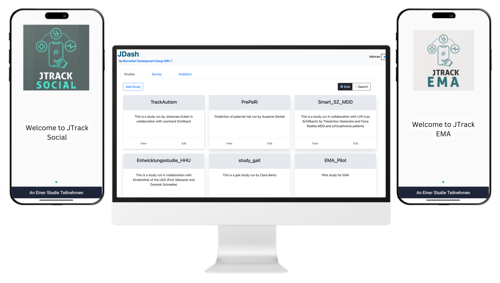

.. JTrack_social_docs documentation master file, created by
   sphinx-quickstart on Sun May  3 16:57:11 2020.
   You can adapt this file completely to your liking, but it should at least
   contain the root `toctree` directive.

Welcome to JTrack Platform
==============================================

JTrack is a platform for remote assessments of an individual's in situ using smartphones. JTrack is an adaptable, configurable, and scalable platform that prioritizes security and privacy.JTrack is more than a single application, you can create, manage a study and, share your collected data using one platform.

JTrack platform includes:

* JTrack Social
* JTrack EMA
* JDash

|
|

|
|

.. toctree:: 
   :maxdepth: 2
   What_is_JTrack
   EMA
   Social
   developers
   JTrack_Dashboard

    

Publications:
+++++++++++++
`JTrack: A Digital Biomarker Platform for Remote Monitoring of Daily-Life Behaviour in Health and Disease <https://doi.org/10.3389/fpubh.2021.763621>`_

`System Comparison for Gait and Balance Monitoring Used for the Evaluation of a Home-Based Training <https://www.mdpi.com/1707028>`_

`JTrack-EMA+: A Cross-platform Ecological Momentary Assessment Application (preprint) <https://preprints.jmir.org/preprint/51689>`_

Contact Us:
+++++++++++
Interested in using JTrack in you study? `Contact us: <https://test.jutrack.inm7.de/jdash/>`_

.. * :ref:`genindex`
.. * :ref:`modindex`
.. * :ref:`search`
