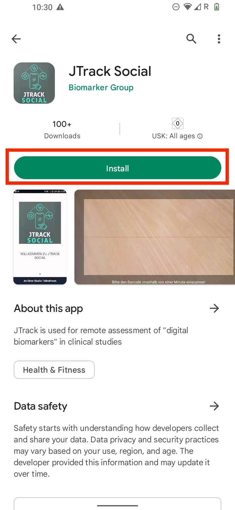
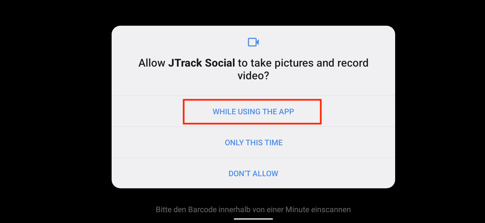
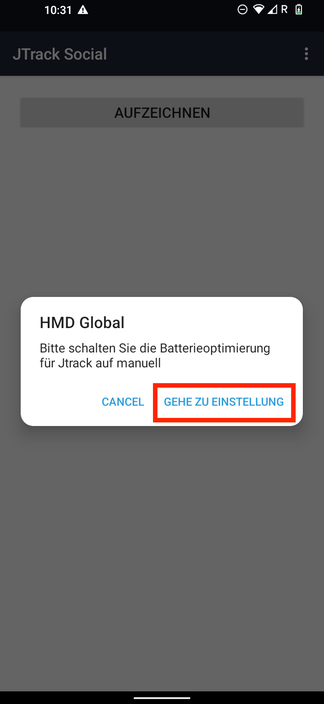
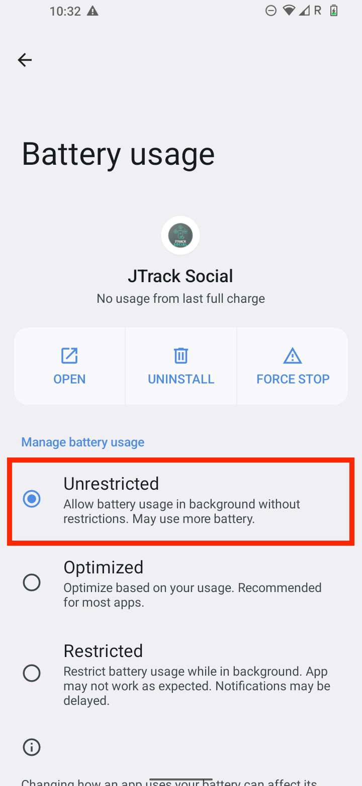
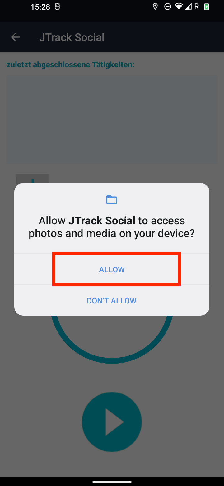
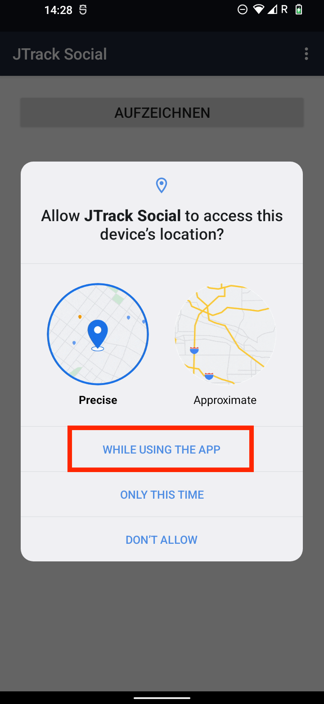

=====================
JTrack Social
=====================
this app is available for Android and iOS operating Systems.

* For Android version 
* For iOS version (check here)
  
General Settings
^^^^^^^^^^^^^^^^

to Install this app first go to the Google Play Store on your Android phone.

|

|

once you installed the app, Open the JTrack Social App and click on Join study button.

|

.. image:: image/Social/social_2.png
   :scale: 40 %
   :align: center

|

This app needs to access the camera for scanning Qr-code. Thereby, accept the permission according to the following image.

|

|

Now you can scan the provided Qr-code using your device camera.

.. important:: (for more information about Qr-code and how to generate them please see...) 

Once the logging is successful, you will see the following screen, which asks you to go to the app settings page and change the settings according to the following steps:

|

.. now click on to go to the application setting page 

|

Now scroll to find "Remove permission and free up space", and make sure that it's disabled.
|

.. image:: image/Social/social_6.png
   :scale: 40 %
   :align: center

|

and then you can go back to the previous step in app setting and look for "battery optimization" and select it
|

.. image:: image/Social/social_5.png
   :scale: 40 %
   :align: center

|

then select the "Unrestricted" option according to the below image, This step will guarantee that the JTrack Social app will not be restricted by the phone application system (Android).
|

|

Now the main setting of the JTrack Social application is done, and
The following steps will depend on the type of study and the selected sensors. different permissions according to the pre-selected
Sensors will be asked. Please follow the following steps to get more information on different required permissions:

Audio Sensor
^^^^^^^^^^^^

Audio sensor: this sensor is responsible for recording audio from the app, and two permissions are required.
First, permission to access the microphone according to the below image:
|

.. image:: image/Social/social_8.png
   :scale: 40 %
   :align: center
   
|

and then permission for access to the file, which is required to save the recorded files.
|

|

Location Sensor
^^^^^^^^^^^^^^^^

if the location sensor is selected, the following permission will be asked, please select according to the image.
|

|

.. important:: please note that this application transforms all location information before recording, therefore all location information is anonymized. 

|

Application Usage Sensor
^^^^^^^^^^^^^^^^^^^^^^^^
To enable the application usage please follow the instruction in the app (left) which will take you to the "Usage access" page (middle), then select the "JTrack Social" application and make sure that permission is granted (right)
.. important:: please note that this module has no access to identifier data and information such as text, images and etc within your application.
|

.. image:: image/Social/social_11.png
   :scale: 15 %
   :align: center
|

Activity Detection Sensor
^^^^^^^^^^^^^^^^^^^^^^^^^
To enable activity recognition sensor, please accept the following permission.
|

.. image:: image/Social/social_12.png
   :scale: 40 %
   :align: center

|